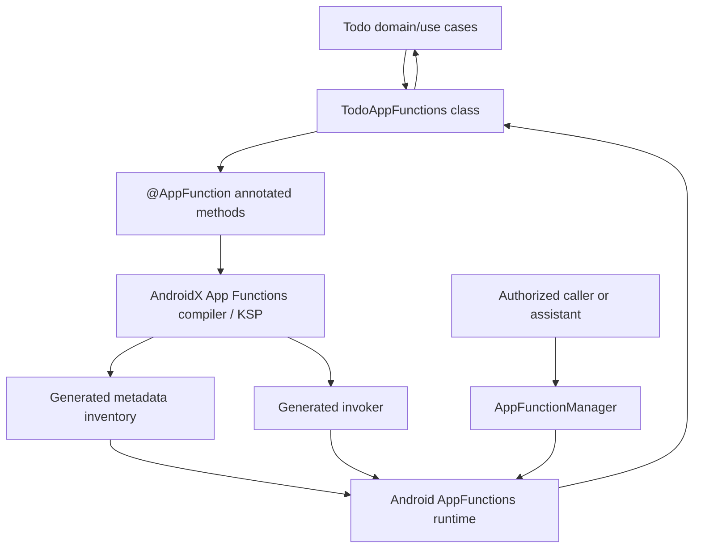
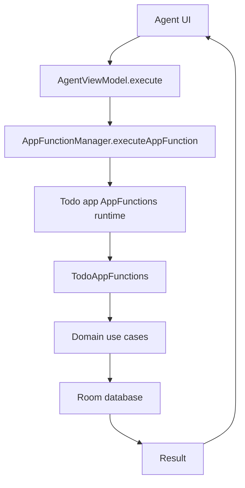
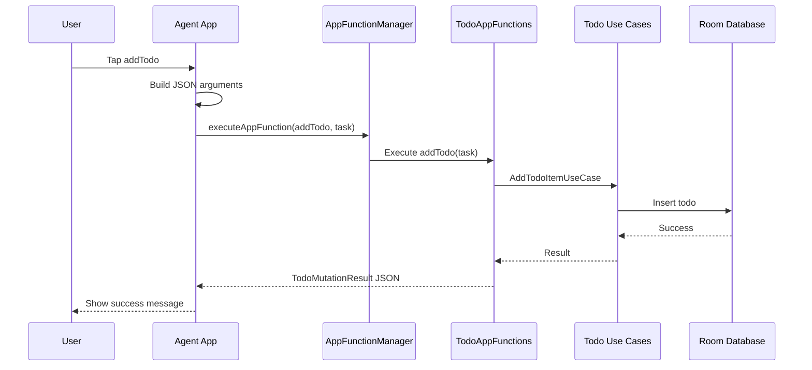
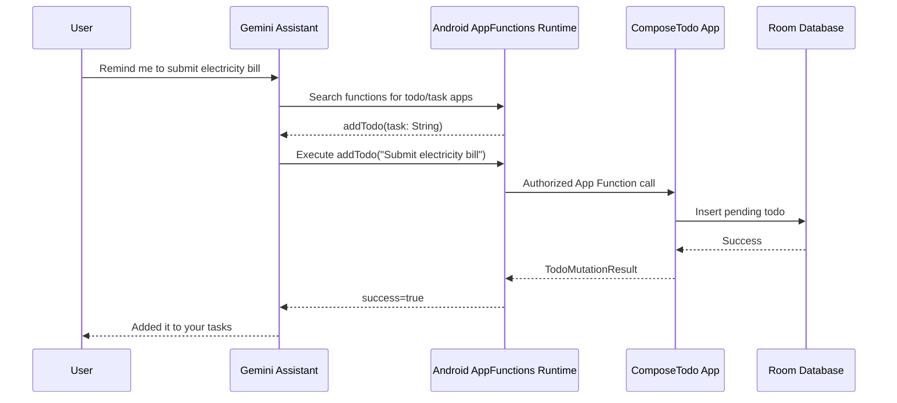
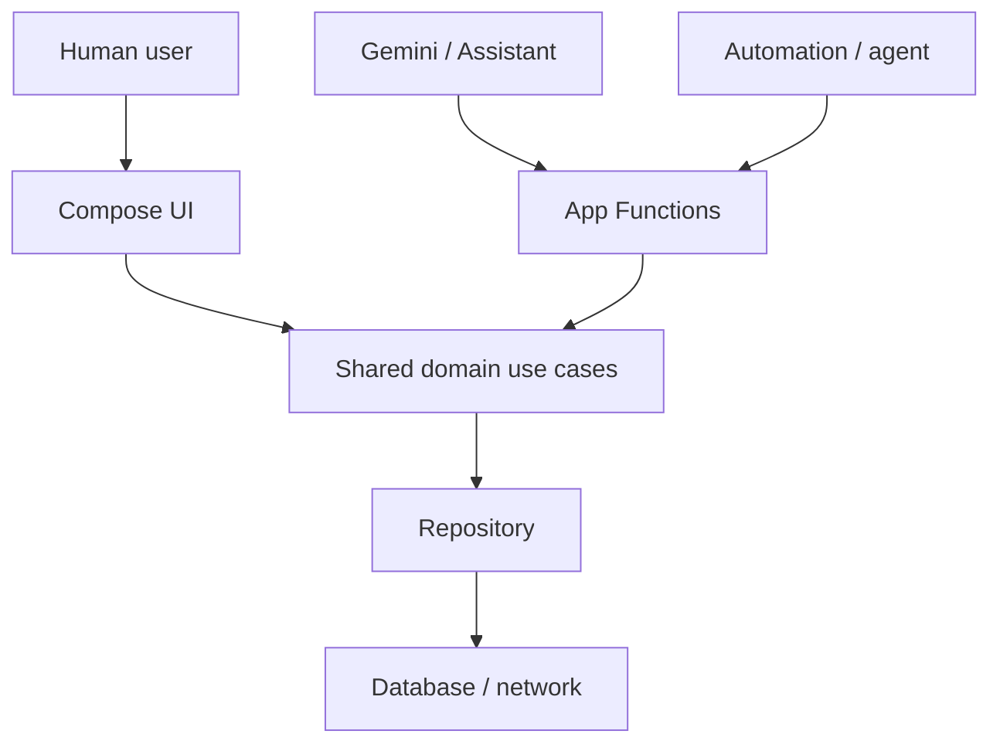

# I Let an AI Assistant Control My Android App: App Functions on Android 16

## Overview

Imagine two Android devs sitting with chai and one says, "Bro, why should Gemini open my Todo app, find the add button, type into the field, and pray the UI did not change? Why cannot the app just expose `addTodo()` directly?"

That is basically the App Functions dream.

Android App Functions are one of the most interesting pieces of the Android 16 AI story. The idea is simple but powerful: instead of an assistant only opening an app and hoping the user taps through the right screens, the app can expose small, typed functions that describe what the app can do.

For a Todo app, that means the app can expose actions like:

- Add a todo
- List all todos
- List pending todos
- List completed todos
- Mark a todo as completed
- Reopen a completed todo
- Delete a todo
- Return todo statistics

This article walks through a small experiment where I built a Jetpack Compose Todo app and a separate agent app that can control the Todo app through Android 16 App Functions.

The practical goal was very simple:

> Build the Todo app so an AI agent can use its functionality directly, without depending on the Todo app UI being open.

There is one important caveat, because otherwise this becomes too filmy: App Functions are still a preview-era Android capability. The Todo app can expose App Functions today, and an authorized caller can execute them, but public Gemini Assistant support for arbitrary third-party apps depends on Google's platform and Gemini rollout. So for this experiment, I built my own agent app to prove the architecture.

## Table of Contents

1. Why I Used a Rooted Pixel 6 Android 16 Emulator
2. How I Rooted the Emulator with RootAVD
3. Project Structure
4. Module-by-Module Setup
5. Real Code Snippets from the App and Agent
6. How Android App Functions Work
7. Deep Dive: App Functions Annotations and Generated Internals
8. Generated App Functions XML and Kotlin Files
9. Commands to Inspect App Functions
10. Step 1: Create the Todo App
11. Step 2: Add AndroidX App Functions Dependencies
12. Step 3: Create Serializable Function Models
13. Step 4: Expose Todo Actions with `@AppFunction`
14. Step 5: Wire Hilt into App Functions
15. Step 6: Add Manifest Metadata and Provider Setup
16. Step 7: Build the Agent App
17. Step 8: Permissions and Privileged Agent Setup
18. Step 9: End-to-End Execution Flow
19. What Worked on the Emulator
20. The Future: Gemini, Agents, and App Capability APIs
21. Conclusion

## Why I Used a Rooted Pixel 6 Android 16 Emulator

I started with a Pixel 6 API 36 emulator image.

For this experiment, the emulator choice mattered more than usual because the caller app needs privileged Android permissions to execute another app's functions.

The two important permissions were:

```xml
<uses-permission android:name="android.permission.EXECUTE_APP_FUNCTIONS" />
<uses-permission android:name="android.permission.EXECUTE_APP_ACTION" />
```

Requesting these permissions in the manifest is not enough for a normal APK.

On Android 16:

- `android.permission.EXECUTE_APP_FUNCTIONS` is a privileged/internal permission.
- `android.permission.EXECUTE_APP_ACTION` is role-managed and can be granted to an Assistant-role app.
- A normal app installed with `adb install` can request these permissions, but it will not actually receive them.

That is why a rooted emulator was needed. This was the "acha, now real Android begins" moment.

I used a Pixel 6 API 36 emulator with a non-16 KB setup because the root and bind-mount workflow was simpler and more predictable. I also avoided depending on a locked-down Play Store style workflow for the final privileged flow because production-like Play Store images often block `adb root` or make system partition experiments more annoying.

The practical rule is:

- If a Google APIs / non-Play image lets `adb root` work, use that. Life is peaceful.
- If the image behaves like a Play Store image and `adb root` does not work, patch it with RootAVD.
- If you need privileged permissions like `EXECUTE_APP_FUNCTIONS`, a normal `adb install` is not enough.

## How I Rooted the Emulator with RootAVD

This is the rooting flow I used for the Android 16 emulator.

First, I created or selected a Pixel 6 API 36 AVD. I used an ARM64 image. Before patching, I made sure the emulator was shut down completely.

Then I used RootAVD. The important input to RootAVD is the `ramdisk.img` from the Android system image.

The command looked like this:

```bash
./rootAVD.sh system-images/android-36/google_apis_playstore/arm64-v8a/ramdisk.img
```

Depending on where the Android SDK is installed, the path may be under something like:

```text
$ANDROID_HOME/system-images/android-36/google_apis_playstore/arm64-v8a/ramdisk.img
```

The simple flow was:

```bash
git clone https://github.com/newbit1/rootAVD.git
cd rootAVD

# Optional: list available ramdisk targets
./rootAVD.sh ListAllAVDs

# Patch the Android 16 emulator ramdisk
./rootAVD.sh system-images/android-36/google_apis_playstore/arm64-v8a/ramdisk.img
```

After patching, I started the emulator again and checked root:

```bash
adb root
adb shell id
```

Expected result:

```text
uid=0(root)
```

I also checked that `su` worked from shell:

```bash
adb shell
whoami
su
whoami
```

The expected final answer was:

```text
root
```

On the emulator, Magisk may ask for root grant. Once granted, `whoami` should return `root`.

That matters because later I needed to:

- Bind-mount the agent APK over a privileged app location.
- Add a privapp permissions XML.
- Clear package manager cache.
- Restart Android framework with `adb shell stop` and `adb shell start`.

This is not a production installation method. This is a developer lab setup so we can test Android's privileged App Functions caller path before public assistant support is generally available.

## Project Structure

The project has two Android application modules:

```text
TodoJetpackCompose/
|-- app/
|   `-- The actual Jetpack Compose Todo app
`-- agent/
    `-- A debug AI-agent-style app that discovers and executes Todo functions
```

The `app` module owns the real Todo data and UI:

```text
app/src/main/java/com/shubham/todojetpackcompose/
|-- data/
|   |-- database/
|   `-- repo/
|-- domain/
|   |-- models/
|   |-- repo/
|   `-- usecases/
|-- presentation/
`-- appfunctions/
```

The `agent` module is a separate app:

```text
agent/src/main/java/com/shubham/todoAgent/
|-- TodoApp.kt
|-- core/
|   |-- appfunctions/
|   |   |-- AppFunctionDataTypeMetadataAdapter.kt
|   |   `-- FunctionMappers.kt
|   `-- di/
|       `-- AppModule.kt
|-- data/
|   `-- executor/
|       `-- GenericFunctionExecutor.kt
|-- domain/
|   `-- model/
|       `-- FunctionDeclaration.kt
`-- presentation/
    |-- AgentViewModel.kt
    `-- ui/
        `-- MainActivity.kt
```

The important design choice is that the Todo app is not just a UI app anymore. It becomes a capability provider.

The UI is one client. The agent is another client.

## Module-by-Module Setup

This project has two app modules, and both have a different job.

### `app` Module

The `app` module is the real Todo app. It owns:

- Compose UI
- Room database
- Todo repository
- Domain use cases
- App Functions exposed by `TodoAppFunctions`
- App metadata XML

The important app module files are:

```text
app/
|-- build.gradle.kts
|-- src/main/AndroidManifest.xml
|-- src/main/res/xml/app_metadata.xml
`-- src/main/java/com/shubham/todojetpackcompose/
    |-- TodoApp.kt
    |-- appfunctions/
    |   |-- TodoAppFunctions.kt
    |   |-- TodoAppFunctionConfiguration.kt
    |   `-- schemas/TodoFunctionSchemas.kt
    |-- data/
    |-- domain/
    `-- presentation/
```

The app Gradle setup enables Compose, Hilt, Room, KSP, and App Functions:

```kotlin
plugins {
    alias(libs.plugins.android.application)
    alias(libs.plugins.kotlin.android)
    alias(libs.plugins.kotlin.compose)
    alias(libs.plugins.ksp.plugin)
    alias(libs.plugins.hilt.plugin)
}

android {
    namespace = "com.shubham.todojetpackcompose"
    compileSdk = 36

    defaultConfig {
        applicationId = "com.shubham.todojetpackcompose"
        minSdk = 36
        targetSdk = 36
    }

    buildFeatures {
        compose = true
    }

    ksp {
        arg("room.schemaLocation", "$projectDir/schemas")
        arg("appfunctions:aggregateAppFunctions", "true")
        arg("appfunctions:generateMetadataFromSchema", "false")
    }
}
```

The App Functions dependencies in the app module are:

```kotlin
implementation(libs.androidx.appfunctions)
implementation(libs.androidx.appfunctions.service)
ksp(libs.androidx.appfunctions.compiler)
```

The app manifest has two important App Functions related pieces.

First, the app uses the Hilt `Application` class:

```xml
<application
    android:name=".TodoApp"
    ...>
```

Second, it points Android to app-level App Functions metadata:

```xml
<property
    android:name="android.app.appfunctions.app_metadata"
    android:resource="@xml/app_metadata" />
```

### `agent` Module

The `agent` module is a separate caller app. It does not own todos. It only discovers and executes functions from the Todo app.

The important agent module files are:

```text
agent/
|-- build.gradle.kts
|-- src/main/AndroidManifest.xml
`-- src/main/java/com/shubham/todoAgent/
    |-- TodoApp.kt
    |-- core/
    |   |-- appfunctions/
    |   |   |-- AppFunctionDataTypeMetadataAdapter.kt
    |   |   `-- FunctionMappers.kt
    |   `-- di/AppModule.kt
    |-- data/executor/GenericFunctionExecutor.kt
    |-- domain/model/FunctionDeclaration.kt
    `-- presentation/
        |-- AgentViewModel.kt
        `-- ui/MainActivity.kt
```

The agent Gradle setup also includes App Functions dependencies because it uses `AppFunctionManager` and App Functions metadata classes:

```kotlin
plugins {
    alias(libs.plugins.android.application)
    alias(libs.plugins.kotlin.android)
    alias(libs.plugins.kotlin.compose)
    alias(libs.plugins.ksp.plugin)
    alias(libs.plugins.hilt.plugin)
}

android {
    namespace = "com.shubham.todoAgent"
    compileSdk = 36

    defaultConfig {
        minSdk = 36
    }

    buildFeatures {
        compose = true
    }

    ksp {
        arg("appfunctions:aggregateAppFunctions", "true")
    }
}
```

The important agent dependencies are:

```kotlin
implementation(libs.androidx.appfunctions)
implementation(libs.androidx.appfunctions.service)
ksp(libs.androidx.appfunctions.compiler)
implementation(libs.converter.gson)
implementation(libs.hilt.android)
ksp(libs.hilt.compiler)
```

The agent manifest requests the two execution permissions:

```xml
<uses-permission android:name="android.permission.EXECUTE_APP_FUNCTIONS" />
<uses-permission android:name="android.permission.EXECUTE_APP_ACTION" />
```

It declares visibility into the Todo app:

```xml
<queries>
    <package android:name="com.shubham.todojetpackcompose" />
</queries>
```

It also declares the Assistant intent filter:

```xml
<intent-filter>
    <action android:name="android.intent.action.ASSIST" />
    <category android:name="android.intent.category.DEFAULT" />
</intent-filter>
```

That intent filter is what made the agent eligible for the Assistant role grant in the emulator.

## Real Code Snippets from the App and Agent

Only the important code is shown here. Full files are useful while coding, but in an article the goal is to show the mechanism without making the reader scroll for ten years.

### 1. App Functions dependencies

Both modules need AndroidX App Functions. The Todo app exposes functions; the agent consumes them.

```kotlin
implementation(libs.androidx.appfunctions)
implementation(libs.androidx.appfunctions.service)
ksp(libs.androidx.appfunctions.compiler)
```

The Todo app also enables KSP aggregation:

```kotlin
ksp {
    arg("appfunctions:aggregateAppFunctions", "true")
    arg("appfunctions:generateMetadataFromSchema", "false")
}
```

### 2. Todo app manifest essentials

The Todo app points Android to app metadata:

```xml
<property
    android:name="android.app.appfunctions.app_metadata"
    android:resource="@xml/app_metadata" />
```

### 3. Agent manifest essentials

The agent requests execution permissions, declares Todo app visibility, and registers as Assistant-role eligible:

```xml
<uses-permission android:name="android.permission.EXECUTE_APP_FUNCTIONS" />
<uses-permission android:name="android.permission.EXECUTE_APP_ACTION" />

<queries>
    <package android:name="com.shubham.todojetpackcompose" />
</queries>

<intent-filter>
    <action android:name="android.intent.action.ASSIST" />
    <category android:name="android.intent.category.DEFAULT" />
</intent-filter>
```

### 4. App Function DTOs

Return structured data, not random strings:

```kotlin
@AppFunctionSerializable(isDescribedByKDoc = true)
data class TodoMutationResult(
    val success: Boolean,
    val message: String,
)

@AppFunctionSerializable(isDescribedByKDoc = true)
data class AppFunctionTodoItem(
    val id: String,
    val task: String,
    @AppFunctionStringValueConstraint(enumValues = ["PENDING", "COMPLETED"])
    val status: String,
)
```

### 5. One real App Function

This is the core pattern: expose business capability, reuse domain use cases, return a typed result.

```kotlin
@AppFunction(isDescribedByKDoc = true)
suspend fun addTodo(
    appFunctionContext: AppFunctionContext,
    task: String,
): TodoMutationResult {
    if (task.isBlank()) {
        throw AppFunctionInvalidArgumentException("Task description must not be blank.")
    }

    val newItem = TodoItem(
        id = System.currentTimeMillis(),
        task = task.trim(),
        status = Utils.TodoStatus.PENDING.name,
    )

    return when (val result = addTodoItemUseCase(newItem)) {
        is Utils.Either.Success -> TodoMutationResult(true, "Task '${newItem.task}' added successfully.")
        is Utils.Either.Error -> TodoMutationResult(false, result.exception.message ?: "Failed to add task.")
    }
}
```

### 6. Hilt bridge for generated invoker

The generated invoker needs a way to create `TodoAppFunctions` with injected use cases:

```kotlin
@HiltAndroidApp
class TodoApp : Application(), AppFunctionConfiguration.Provider {
    @Inject lateinit var todoAppFunctionConfiguration: TodoAppFunctionConfiguration

    override val appFunctionConfiguration: AppFunctionConfiguration
        get() = todoAppFunctionConfiguration.build()
}
```

```kotlin
class TodoAppFunctionConfiguration @Inject constructor(
    private val todoAppFunctionsProvider: Provider<TodoAppFunctions>,
) {
    fun build(): AppFunctionConfiguration =
        AppFunctionConfiguration.Builder()
            .addEnclosingClassFactory(TodoAppFunctions::class.java) {
                todoAppFunctionsProvider.get()
            }
            .build()
}
```

### 7. Agent discovery

The agent discovers functions through the Android platform manager:

```kotlin
val spec = AppFunctionSearchSpec(packageNames = setOf(TOOL_PACKAGE))

manager.observeAppFunctions(spec)
    .catch { error -> showDiscoveryError(error) }
    .onEach { packages ->
        val pkg = packages.firstOrNull() ?: return@onEach showEmptyState()

        val map = pkg.appFunctions.toFunctionDeclarations()
        _functions.value = map.keys.toList().sortedBy { it.shortName }
    }
    .launchIn(viewModelScope)
```

### 8. Agent execution

Execution also goes through the Android platform manager:

```kotlin
val request = ExecuteAppFunctionRequest(
    functionIdentifier = functionDeclaration.name,
    targetPackageName = "com.shubham.todojetpackcompose",
    functionParameters = functionParameters,
)

val response = manager.executeAppFunction(request)
```

That is the whole trick: the agent sends a function ID and arguments to Android; Android invokes the generated App Functions bridge in the Todo app; the same domain logic updates Room.

## How Android App Functions Work

At a high level, App Functions work like this:



A function is just a Kotlin function, but it is annotated with `@AppFunction`.

Example:

```kotlin
@AppFunction(isDescribedByKDoc = true)
suspend fun addTodo(
    appFunctionContext: AppFunctionContext,
    task: String,
): TodoMutationResult
```

The annotation tells the AndroidX App Functions compiler:

- This method is callable as an App Function.
- Its parameters should become function input metadata.
- Its return type should become function output metadata.
- Its KDoc can be used as a natural-language description.

Then KSP generates internal support classes. In this project those generated classes include:

```text
$TodoAppFunctions_AppFunctionInventory
$TodoAppFunctions_AppFunctionInvoker
```

The inventory describes what functions exist. The invoker knows how to call the right Kotlin method at runtime.

This is the part that makes App Functions feel assistant-friendly: instead of an AI guessing how to use your UI, it can inspect typed function metadata.

## Deep Dive: App Functions Annotations and Generated Internals

Now let us go slightly deeper. This is the part where one dev says, "Okay nice demo, but what is actually happening inside?"

There are four main annotation/runtime pieces in this project:

```text
@AppFunction
@AppFunctionSerializable
@AppFunctionStringValueConstraint
AppFunctionConfiguration.Provider
```

### `@AppFunction`

`@AppFunction` is the main annotation. It marks a Kotlin function as something the App Functions runtime can expose.

In this project:

```kotlin
@AppFunction(isDescribedByKDoc = true)
suspend fun addTodo(
    appFunctionContext: AppFunctionContext,
    task: String,
): TodoMutationResult
```

Important details:

- The function can be `suspend`, which is useful because app work usually touches databases, repositories, network, or other async sources.
- `AppFunctionContext` is passed by the framework. The agent does not provide it manually.
- Normal Kotlin parameters like `task: String` become function parameters.
- The return type becomes function response metadata.
- `isDescribedByKDoc = true` tells the compiler to use KDoc as part of the natural-language function description.

This matters a lot for agents. A human can read a button label and infer intent. An agent needs structured metadata plus a description.

So this KDoc:

```kotlin
/**
 * Creates and saves a new todo item with the given task description.
 * Use this when the user wants to add, create, or remember a new task or todo item.
 */
```

becomes part of the semantic description of the function.

### `@AppFunctionSerializable`

App Functions should return structured objects, not random strings.

For example:

```kotlin
@AppFunctionSerializable(isDescribedByKDoc = true)
data class TodoMutationResult(
    val success: Boolean,
    val message: String,
)
```

This tells the compiler:

- This type can cross the App Functions boundary.
- Its properties should become typed metadata.
- The runtime can serialize and deserialize it.
- Agents can understand the response shape.

For a Todo item:

```kotlin
@AppFunctionSerializable(isDescribedByKDoc = true)
data class AppFunctionTodoItem(
    val id: String,
    val task: String,
    val status: String,
)
```

I intentionally used a separate App Functions DTO instead of returning the internal database entity. That keeps the external contract stable even if the Room schema changes later.

### `@AppFunctionStringValueConstraint`

For `status`, I constrained valid values:

```kotlin
@AppFunctionStringValueConstraint(enumValues = ["PENDING", "COMPLETED"])
val status: String
```

This gives the generated metadata an enum-like hint.

For humans this looks small, but for agents it is important. Instead of guessing whether the status should be `done`, `completed`, `complete`, or `COMPLETED`, the metadata says the allowed values are:

```text
PENDING
COMPLETED
```

Small thing, big reduction in AI jugaad.

### `AppFunctionContext`

Every App Function receives an `AppFunctionContext`:

```kotlin
appFunctionContext: AppFunctionContext
```

Android provides this context when the authorized caller executes the function.

### `AppFunctionInvalidArgumentException`

For bad user/agent input, I used App Functions specific exceptions:

```kotlin
if (task.isBlank()) {
    throw AppFunctionInvalidArgumentException("Task description must not be blank.")
}
```

This is better than letting a random crash happen. The function contract can tell the caller, "Your argument is wrong", which is exactly what an agent needs in order to recover.

### Generated Inventory

After KSP runs, AndroidX generates an inventory class.

In this project:

```text
$TodoAppFunctions_AppFunctionInventory
```

Conceptually, it contains a map like:

```text
function id -> compile-time metadata
```

Example function IDs:

```text
com.shubham.todojetpackcompose.appfunctions.TodoAppFunctions#addTodo
com.shubham.todojetpackcompose.appfunctions.TodoAppFunctions#getAllTodos
com.shubham.todojetpackcompose.appfunctions.TodoAppFunctions#completeTodo
```

The metadata includes:

- Function ID
- Whether it is enabled by default
- Parameters
- Response type
- Data type components
- Descriptions
- Deprecation metadata if present

This inventory is what lets discovery work. Without it, the caller has nothing structured to inspect.

### Generated Invoker

KSP also generates:

```text
$TodoAppFunctions_AppFunctionInvoker
```

The invoker is the switchboard.

Conceptually:

```kotlin
when (functionIdentifier) {
    "TodoAppFunctions#addTodo" -> create TodoAppFunctions and call addTodo(...)
    "TodoAppFunctions#getAllTodos" -> create TodoAppFunctions and call getAllTodos(...)
    else -> throw function not found
}
```

In this project, the generated invoker uses the configured factory:

```kotlin
ConfigurableAppFunctionFactory<TodoAppFunctions>(
    appFunctionContext.context
)
.createEnclosingClass(TodoAppFunctions::class.java)
.addTodo(appFunctionContext, parameters["task"] as String)
```

That is why the Hilt configuration matters. The generated code needs to know how to create `TodoAppFunctions`, and `TodoAppFunctions` needs real use cases injected.

### Why This Is Cleaner Than Intent Extras

An old-school way to expose app actions might be:

```text
Intent action = ADD_TODO
extra task = "Buy milk"
```

That works, but it is loosely typed and usually poorly discoverable.

App Functions give us:

- Discoverable functions
- Typed parameters
- Typed return values
- Natural-language descriptions
- Permission-controlled execution
- A route for future assistant integration

So instead of "open this activity with extras and hope", we get something much closer to a real tool API inside Android.

## Generated App Functions XML and Kotlin Files

Yes, we do get generated XML and generated Kotlin files.

After building:

```bash
./gradlew :app:assembleDebug :agent:assembleDebug
```

the App Functions compiler generates files under:

```text
app/build/generated/ksp/debug/
agent/build/generated/ksp/debug/
```

For the Todo app, these are the important generated App Functions files:

```text
app/build/generated/ksp/debug/resources/assets/app_functions.xml
app/build/generated/ksp/debug/resources/assets/app_functions_v2.xml
app/build/generated/ksp/debug/kotlin/com/shubham/todojetpackcompose/appfunctions/$TodoAppFunctions_AppFunctionInventory.kt
app/build/generated/ksp/debug/kotlin/com/shubham/todojetpackcompose/appfunctions/$TodoAppFunctions_AppFunctionInvoker.kt
app/build/generated/ksp/debug/kotlin/com/shubham/todojetpackcompose/appfunctions/TodoAppFunctionsIds.kt
app/build/generated/ksp/debug/kotlin/com/shubham/todojetpackcompose/appfunctions/schemas/$AppFunctionTodoItemFactory.kt
app/build/generated/ksp/debug/kotlin/com/shubham/todojetpackcompose/appfunctions/schemas/$TodoMutationResultFactory.kt
app/build/generated/ksp/debug/kotlin/com/shubham/todojetpackcompose/appfunctions/schemas/$TodoStatsFactory.kt
```

There are also aggregated runtime glue files:

```text
app/build/generated/ksp/debug/kotlin/androidx/appfunctions/internal/$AggregatedAppFunctionInventory_Impl.kt
app/build/generated/ksp/debug/kotlin/androidx/appfunctions/service/internal/$AggregatedAppFunctionInvoker_Impl.kt
```

The first XML file is simple. It lists function IDs and whether they are enabled by default:

```xml
<appfunctions>
    <appfunction>
        <function_id>com.shubham.todojetpackcompose.appfunctions.TodoAppFunctions#addTodo</function_id>
        <enabled_by_default>true</enabled_by_default>
    </appfunction>
    <appfunction>
        <function_id>com.shubham.todojetpackcompose.appfunctions.TodoAppFunctions#getAllTodos</function_id>
        <enabled_by_default>true</enabled_by_default>
    </appfunction>
</appfunctions>
```

The second XML file is richer. It contains:

- Function IDs
- Descriptions from KDoc
- Parameter names
- Parameter required/nullable info
- Response types
- Serializable DTO schemas
- Enum values like `PENDING` and `COMPLETED`

Example from `app_functions_v2.xml`:

```xml
<appfunction>
    <id>com.shubham.todojetpackcompose.appfunctions.TodoAppFunctions#addTodo</id>
    <enabledByDefault>true</enabledByDefault>
    <description>Creates and saves a new todo item with the given task description.
 Use this when the user wants to add, create, or remember a new task or todo item.</description>
    <parameters>
        <isRequired>true</isRequired>
        <name>task</name>
        <description>The task description to save. Must not be blank.</description>
    </parameters>
</appfunction>
```

And for the status enum:

```xml
<enumValues>PENDING</enumValues>
<enumValues>COMPLETED</enumValues>
```

This generated XML is useful for debugging because it proves the compiler saw your annotations and generated metadata.

The agent module also gets generated App Functions files because it has the compiler dependency, but its XML is empty:

```xml
<appfunctions/>
```

That is expected. The agent consumes functions; it does not expose any functions of its own.

## Commands to Inspect App Functions

There are several ways to inspect what functions exist.

### 1. Use Android's Shell Command

Important emulator detail: this worked for me on an API 36.1 system image:

```text
system-images;android-36.1;google_apis;arm64-v8a
```

On my older API 36 image, `cmd app_function` existed but returned:

```text
No shell command implementation.
```

So if this command prints that, your app may still be fine. The platform image is probably too old. Update/install an API 36.1 AVD and test there.

Create a fresh API 36.1 AVD:

```bash
sdkmanager "system-images;android-36.1;google_apis;arm64-v8a"

avdmanager create avd \
  -n Pixel_6_36_1_AppFunctions \
  -k "system-images;android-36.1;google_apis;arm64-v8a" \
  -d pixel_6
```

Boot it and install the app:

```bash
emulator -avd Pixel_6_36_1_AppFunctions
adb install -r app/build/outputs/apk/debug/app-debug.apk
```

List all App Functions:

```bash
adb shell cmd app_function list-app-functions
```

If more than one emulator/device is connected, plain `adb shell` will fail with:

```text
adb: more than one device/emulator
```

In that case, select the Android 16 API 36.1 emulator explicitly:

```bash
adb -s emulator-5556 shell cmd app_function list-app-functions
```

Or export the serial once in that terminal session so the shorter command works:

```bash
export ANDROID_SERIAL=emulator-5556
adb shell cmd app_function list-app-functions
```

On API 36.1, this returns JSON. My Todo package appeared like this:

```json
{
  "com.shubham.todojetpackcompose": [
    {
      "AppFunctionStaticMetadata-com.shubham.todojetpackcompose": {
        "description": [
          "Returns every todo item currently stored in the app, both pending and completed.\n Use this when the user wants to see, list, or review all their tasks."
        ],
        "functionId": [
          "com.shubham.todojetpackcompose.appfunctions.TodoAppFunctions#getAllTodos"
        ],
        "packageName": [
          "com.shubham.todojetpackcompose"
        ]
      }
    }
  ]
}
```

This output is huge because it includes descriptions, parameters, response metadata, runtime metadata, and component schemas. To focus only on your app:

```bash
adb shell cmd app_function list-app-functions | grep -n -A 80 'com.shubham.todojetpackcompose'
```

To print only the Todo function IDs:

```bash
adb shell cmd app_function list-app-functions \
  | jq -r '."com.shubham.todojetpackcompose"[] | .[]? | select(type=="object") | .functionId?[]?' \
  | sort -u
```

Expected output:

```text
com.shubham.todojetpackcompose.appfunctions.TodoAppFunctions#addTodo
com.shubham.todojetpackcompose.appfunctions.TodoAppFunctions#completeTodo
com.shubham.todojetpackcompose.appfunctions.TodoAppFunctions#deleteTodo
com.shubham.todojetpackcompose.appfunctions.TodoAppFunctions#getAllTodos
com.shubham.todojetpackcompose.appfunctions.TodoAppFunctions#getCompletedTodos
com.shubham.todojetpackcompose.appfunctions.TodoAppFunctions#getPendingTodos
com.shubham.todojetpackcompose.appfunctions.TodoAppFunctions#getTodoStats
com.shubham.todojetpackcompose.appfunctions.TodoAppFunctions#reopenTodo
```

Note: on my API 36.1 build, `list-app-functions --package ...` was not supported even though some articles mention it. The command help only showed `--user` for listing, so filtering the full JSON was the reliable approach.

Execute `getTodoStats`:

```bash
adb shell cmd app_function execute-app-function \
  --package com.shubham.todojetpackcompose \
  --function 'com.shubham.todojetpackcompose.appfunctions.TodoAppFunctions#getTodoStats' \
  --parameters '{}'
```

Real output from the fresh API 36.1 AVD:

```json
{
  "androidAppfunctionsReturnValue": [
    {
      "completed": [
        0
      ],
      "pending": [
        0
      ],
      "total": [
        0
      ]
    }
  ]
}
```

Execute `addTodo`:

```bash
adb shell "cmd app_function execute-app-function \
--package com.shubham.todojetpackcompose \
--function 'com.shubham.todojetpackcompose.appfunctions.TodoAppFunctions#addTodo' \
--parameters '{\"task\":\"Created from cmd app_function\"}'"
```

Real output:

```json
{
  "androidAppfunctionsReturnValue": [
    {
      "success": [
        true
      ],
      "message": [
        "Task 'Created from cmd app_function' added successfully."
      ]
    }
  ]
}
```

Read it back with `getAllTodos`:

```bash
adb shell cmd app_function execute-app-function \
  --package com.shubham.todojetpackcompose \
  --function 'com.shubham.todojetpackcompose.appfunctions.TodoAppFunctions#getAllTodos' \
  --parameters '{}'
```

Real output:

```json
{
  "androidAppfunctionsReturnValue": [
    {
      "status": [
        "PENDING"
      ],
      "id": [
        "1777198668297"
      ],
      "task": [
        "Created from cmd app_function"
      ]
    }
  ]
}
```

Execute `completeTodo`:

```bash
adb shell "cmd app_function execute-app-function \
--package com.shubham.todojetpackcompose \
--function 'com.shubham.todojetpackcompose.appfunctions.TodoAppFunctions#completeTodo' \
--parameters '{\"todoId\":\"1777198668297\"}'"
```

The shape of the result is:

```json
{
  "androidAppfunctionsReturnValue": [
    {
      "success": [
        true
      ],
      "message": [
        "Todo 'Created from cmd app_function' marked as completed."
      ]
    }
  ]
}
```

### 2. Inspect Generated XML

This is the most direct build-time check:

```bash
sed -n '1,220p' app/build/generated/ksp/debug/resources/assets/app_functions.xml
sed -n '1,260p' app/build/generated/ksp/debug/resources/assets/app_functions_v2.xml
```

Or just list the function IDs:

```bash
grep -o 'com.shubham.todojetpackcompose[^<]*' \
  app/build/generated/ksp/debug/resources/assets/app_functions.xml
```

Expected function IDs:

```text
com.shubham.todojetpackcompose.appfunctions.TodoAppFunctions#addTodo
com.shubham.todojetpackcompose.appfunctions.TodoAppFunctions#completeTodo
com.shubham.todojetpackcompose.appfunctions.TodoAppFunctions#deleteTodo
com.shubham.todojetpackcompose.appfunctions.TodoAppFunctions#getAllTodos
com.shubham.todojetpackcompose.appfunctions.TodoAppFunctions#getCompletedTodos
com.shubham.todojetpackcompose.appfunctions.TodoAppFunctions#getPendingTodos
com.shubham.todojetpackcompose.appfunctions.TodoAppFunctions#getTodoStats
com.shubham.todojetpackcompose.appfunctions.TodoAppFunctions#reopenTodo
```

### 3. Inspect Generated Kotlin

Check the generated inventory:

```bash
sed -n '1,220p' \
  'app/build/generated/ksp/debug/kotlin/com/shubham/todojetpackcompose/appfunctions/$TodoAppFunctions_AppFunctionInventory.kt'
```

Check the generated invoker:

```bash
sed -n '1,220p' \
  'app/build/generated/ksp/debug/kotlin/com/shubham/todojetpackcompose/appfunctions/$TodoAppFunctions_AppFunctionInvoker.kt'
```

The inventory proves metadata exists. The invoker proves each function can be mapped to an actual Kotlin call.

### 4. Inspect APK / Package Manager Registration

After installing the Todo app:

```bash
adb shell dumpsys package com.shubham.todojetpackcompose | grep -E \
  'AppFunctionService|appfunctions|app_metadata'
```

Important output includes:

```text
android.app.appfunctions.AppFunctionService
android.permission.BIND_APP_FUNCTION_SERVICE
```

This proves the package contains App Functions service components and app metadata.

### 5. Inspect Agent Permissions

The agent cannot execute cross-app functions unless the permissions are actually granted:

```bash
adb shell dumpsys package com.shubham.todoAgent | grep -E \
  'PRIVILEGED|EXECUTE_APP_FUNCTIONS|EXECUTE_APP_ACTION|granted='
```

Expected:

```text
android.permission.EXECUTE_APP_FUNCTIONS: granted=true
android.permission.EXECUTE_APP_ACTION: granted=true, flags=[ GRANTED_BY_ROLE]
```

### 6. Inspect Runtime Through the Agent App

The agent app itself is also an inspector.

It does two things:

- Calls `AppFunctionManager.observeAppFunctions(...)`.
- Executes selected functions with `AppFunctionManager.executeAppFunction(...)`.

When working, the UI shows:

```text
Discovered 8 functions
```

That is how I got the complete runtime list in-app.

### 7. Inspect Logs

Useful logcat command:

```bash
adb logcat -d -v time | grep -E \
  'AgentViewModel|GenericFunctionExecutor|AppFunction'
```

Important lines I saw:

```text
AgentViewModel: Executing: short=addTodo, name=com.shubham.todojetpackcompose.appfunctions.TodoAppFunctions#addTodo
GenericFunctionExecutor: executeAppFunction(...)
```

This proves the agent discovered metadata and executed the selected function.

## Step 1: Create the Todo App

The Todo app is intentionally simple:

- Jetpack Compose for UI
- Room for persistence
- Repository and use cases for business logic
- Hilt for dependency injection

The app stores todos with:

- `id`
- `task`
- `status`

The UI can already:

- Add tasks
- Toggle pending/completed
- Delete tasks
- Show pending and completed sections

The App Functions layer reuses the same use cases as the UI. This is important because the agent should not have a separate implementation of Todo behavior.

## Step 2: Add AndroidX App Functions Dependencies

In the app module, I added AndroidX App Functions runtime, service, and compiler support:

```kotlin
implementation(libs.androidx.appfunctions)
implementation(libs.androidx.appfunctions.service)
ksp(libs.androidx.appfunctions.compiler)
```

The app module also enables aggregation:

```kotlin
ksp {
    arg("appfunctions:aggregateAppFunctions", "true")
    arg("appfunctions:generateMetadataFromSchema", "false")
}
```

In this project I kept `generateMetadataFromSchema` disabled because enabling it caused a KSP crash in this setup. The direct annotated-function metadata path was enough for this experiment.

## Step 3: Create Serializable Function Models

App Functions should use typed inputs and outputs.

For return values, I created small serializable models:

```kotlin
@AppFunctionSerializable(isDescribedByKDoc = true)
data class AppFunctionTodoItem(
    val id: String,
    val task: String,
    val status: String,
)

@AppFunctionSerializable(isDescribedByKDoc = true)
data class TodoMutationResult(
    val success: Boolean,
    val message: String,
)

@AppFunctionSerializable(isDescribedByKDoc = true)
data class TodoStats(
    val total: Int,
    val completed: Int,
    val pending: Int,
)
```

These models are small on purpose. App Functions should expose a stable capability API, not leak the whole internal Room entity model.

## Step 4: Expose Todo Actions with `@AppFunction`

The main App Functions class is:

```text
app/src/main/java/com/shubham/todojetpackcompose/appfunctions/TodoAppFunctions.kt
```

It exposes eight functions:

```text
addTodo(task)
getAllTodos()
getPendingTodos()
getCompletedTodos()
completeTodo(todoId)
reopenTodo(todoId)
deleteTodo(todoId)
getTodoStats()
```

Each method uses the same domain use cases as the Compose UI.

For example, adding a todo:

```kotlin
@AppFunction(isDescribedByKDoc = true)
suspend fun addTodo(
    appFunctionContext: AppFunctionContext,
    task: String,
): TodoMutationResult {
    if (task.isBlank()) {
        throw AppFunctionInvalidArgumentException("Task description must not be blank.")
    }

    val newItem = TodoItem(
        id = System.currentTimeMillis(),
        task = task.trim(),
        status = Utils.TodoStatus.PENDING.name,
    )

    return when (val result = addTodoItemUseCase(newItem)) {
        is Utils.Either.Success -> {
            result.data.first()
            TodoMutationResult(
                success = true,
                message = "Task '${newItem.task}' added successfully.",
            )
        }

        is Utils.Either.Error -> {
            TodoMutationResult(
                success = false,
                message = result.exception.message ?: "Failed to add task.",
            )
        }
    }
}
```

This is the core idea:

> The function is not a UI automation script. It is direct access to app capability.

## Step 5: Wire Hilt into App Functions

The App Functions runtime needs a way to construct `TodoAppFunctions`.

The app implements `AppFunctionConfiguration.Provider` in the `Application` class:

```kotlin
@HiltAndroidApp
class TodoApp :
    Application(),
    AppFunctionConfiguration.Provider {

    @Inject
    lateinit var todoAppFunctionConfiguration: TodoAppFunctionConfiguration

    override val appFunctionConfiguration: AppFunctionConfiguration
        get() = todoAppFunctionConfiguration.build()
}
```

Then `TodoAppFunctionConfiguration` registers a factory:

```kotlin
class TodoAppFunctionConfiguration @Inject constructor(
    private val todoAppFunctionsProvider: Provider<TodoAppFunctions>,
) {
    fun build(): AppFunctionConfiguration =
        AppFunctionConfiguration.Builder()
            .addEnclosingClassFactory(TodoAppFunctions::class.java) {
                todoAppFunctionsProvider.get()
            }
            .build()
}
```

This lets the generated invoker create the App Functions class through Hilt.

## Step 6: Add Manifest Metadata and Provider Setup

The Todo app manifest includes App Functions metadata:

```xml
<property
    android:name="android.app.appfunctions.app_metadata"
    android:resource="@xml/app_metadata" />
```

The metadata file describes the app:

```xml
<app-metadata>
    <description>
        ComposeTodo is a local todo list app. It can list all tasks, only pending tasks,
        or only completed tasks; add a new task; mark a task as completed; reopen a completed
        task; delete a task; and return todo statistics.
    </description>

    <display-description>
        View and manage your todo tasks with add, list, complete, reopen, delete, and stats.
    </display-description>
</app-metadata>
```

## Step 7: Build the Agent App

The agent app is a separate Android app.

Its job is:

1. Discover functions exposed by the Todo app.
2. Render them as callable actions.
3. Collect arguments from the user.
4. Execute the selected function.
5. Render the JSON result.

The agent uses the real platform manager path:

```kotlin
val spec = AppFunctionSearchSpec(packageNames = setOf(TOOL_PACKAGE))
manager.observeAppFunctions(spec)
```

Execution stays on the platform path:



## Step 8: Permissions and Privileged Agent Setup

The agent manifest requests:

```xml
<uses-permission android:name="android.permission.EXECUTE_APP_FUNCTIONS" />
<uses-permission android:name="android.permission.EXECUTE_APP_ACTION" />
```

It also declares itself as Assistant-role eligible:

```xml
<intent-filter>
    <action android:name="android.intent.action.ASSIST" />
    <category android:name="android.intent.category.DEFAULT" />
</intent-filter>
```

But the manifest alone is not enough.

A normal installed APK showed:

```text
EXECUTE_APP_FUNCTIONS=missing
EXECUTE_APP_ACTION=missing
```

After rooting the emulator, I staged the agent as a temporary privileged app and added a tiny privapp allowlist:

```xml
<permissions>
    <privapp-permissions package="com.shubham.todoAgent">
        <permission name="android.permission.EXECUTE_APP_FUNCTIONS" />
    </privapp-permissions>
</permissions>
```

Then I granted the Assistant role:

```bash
adb shell cmd role set-bypassing-role-qualification true
adb shell cmd role add-role-holder android.app.role.ASSISTANT com.shubham.todoAgent
```

After that, PackageManager showed:

```text
android.permission.EXECUTE_APP_FUNCTIONS: granted=true
android.permission.EXECUTE_APP_ACTION: granted=true, flags=[GRANTED_BY_ROLE]
```

That was the key unlock.

### ADB Commands I Used for Permission Setup

Here is the practical command flow. This is the "bhai just tell me what to run" section.

First build both APKs:

```bash
./gradlew :app:assembleDebug :agent:assembleDebug
```

Make sure the emulator is online and root is active:

```bash
adb devices -l
adb root
adb wait-for-device
adb shell id
```

You want to see:

```text
uid=0(root)
```

Install the Todo app normally:

```bash
adb install -r app/build/outputs/apk/debug/app-debug.apk
```

If the agent was already installed as a normal APK, remove it first:

```bash
adb uninstall com.shubham.todoAgent
```

Stage the agent APK in a temporary system-like directory:

```bash
adb shell mkdir -p /data/local/tmp/todoagent-runtime/system/priv-app/MusicFX
adb shell mkdir -p /data/local/tmp/todoagent-runtime/system/etc/permissions

adb push agent/build/outputs/apk/debug/agent-debug.apk \
  /data/local/tmp/todoagent-runtime/system/priv-app/MusicFX/MusicFX.apk
```

Create the privapp permission allowlist:

```bash
adb shell 'printf "%s\n" \
"<?xml version=\"1.0\" encoding=\"utf-8\"?>" \
"<permissions>" \
"    <privapp-permissions package=\"com.shubham.todoAgent\">" \
"        <permission name=\"android.permission.EXECUTE_APP_FUNCTIONS\" />" \
"    </privapp-permissions>" \
"</permissions>" \
> /data/local/tmp/todoagent-runtime/system/etc/permissions/todoagent-privapp-permissions.xml'
```

Set owner, permissions, and SELinux context:

```bash
adb shell chmod 644 \
  /data/local/tmp/todoagent-runtime/system/priv-app/MusicFX/MusicFX.apk \
  /data/local/tmp/todoagent-runtime/system/etc/permissions/todoagent-privapp-permissions.xml

adb shell chown root:root \
  /data/local/tmp/todoagent-runtime/system/priv-app/MusicFX/MusicFX.apk \
  /data/local/tmp/todoagent-runtime/system/etc/permissions/todoagent-privapp-permissions.xml

adb shell chcon u:object_r:system_file:s0 \
  /data/local/tmp/todoagent-runtime/system/priv-app/MusicFX/MusicFX.apk \
  /data/local/tmp/todoagent-runtime/system/etc/permissions/todoagent-privapp-permissions.xml
```

Bind mount the staged agent APK over an existing privileged app slot:

```bash
adb shell mount --bind \
  /data/local/tmp/todoagent-runtime/system/priv-app/MusicFX/MusicFX.apk \
  /system/priv-app/MusicFX/MusicFX.apk
```

Bind mount the permission XML into `/system/etc/permissions`.

In my setup I used this existing XML file as a mount target:

```bash
adb shell mount --bind \
  /data/local/tmp/todoagent-runtime/system/etc/permissions/todoagent-privapp-permissions.xml \
  /system/etc/permissions/android.software.window_magnification.xml
```

Clear package manager cache and restart Android framework:

```bash
adb shell 'rm -rf /data/system/package_cache/*'
adb shell stop
adb shell start
adb wait-for-device
```

After Android starts again, grant the Assistant role:

```bash
adb shell cmd role set-bypassing-role-qualification true
adb shell cmd role add-role-holder android.app.role.ASSISTANT com.shubham.todoAgent
```

Verify role holder:

```bash
adb shell cmd role get-role-holders android.app.role.ASSISTANT
```

Expected:

```text
com.shubham.todoAgent
```

Verify package permissions:

```bash
adb shell dumpsys package com.shubham.todoAgent | grep -E \
  'codePath|PRIVILEGED|EXECUTE_APP_FUNCTIONS|EXECUTE_APP_ACTION|granted='
```

Expected important lines:

```text
privateFlags=[ ... PRIVILEGED ... ]
android.permission.EXECUTE_APP_FUNCTIONS: granted=true
android.permission.EXECUTE_APP_ACTION: granted=true, flags=[ GRANTED_BY_ROLE]
```

Launch the agent:

```bash
adb shell am start -n com.shubham.todoAgent/com.shubham.todoAgent.presentation.ui.MainActivity
```

Launch the Todo app:

```bash
adb shell am start -n \
  com.shubham.todojetpackcompose/com.shubham.todojetpackcompose.presentation.MainActivity
```

### In-App Checks

Inside the agent app, I added a visible permission status card.

The expected status is:

```text
EXECUTE_APP_FUNCTIONS=granted, EXECUTE_APP_ACTION=granted
```

Then the agent should show:

```text
Discovered 8 functions
```

After that, I tested in-app like this:

1. Tap `addTodo`.
2. Enter `AgentTodoTest`.
3. Tap `Run`.
4. Confirm the result says `success: true`.
5. Run `getAllTodos`.
6. Confirm the new todo is returned.
7. Open the Todo app UI.
8. Confirm the same task is visible in the pending list.

The important mental model:

```text
Terminal grants capability to the agent app.
Agent UI proves discovery and execution.
Todo UI proves the real database changed.
```

## Step 9: End-to-End Execution Flow

Here is the complete flow from pressing a button in the agent to updating the Todo app database:



The important part is that the Todo app UI does not need to be open for the function to run. The agent calls app capability directly.

## What Worked on the Emulator

After the root and privileged setup, I verified:

```text
EXECUTE_APP_FUNCTIONS=granted
EXECUTE_APP_ACTION=granted
```

The agent discovered all eight functions:

```text
Discovered 8 functions
```

Then I executed:

```text
addTodo(task = "AgentTodoTest")
```

The result:

```json
{
  "message": "Task 'AgentTodoTest' added successfully.",
  "success": true
}
```

Then I executed:

```text
getAllTodos()
```

The returned list included:

```json
{
  "id": "1777198668297",
  "status": "PENDING",
  "task": "AgentTodoTest"
}
```

Finally, I opened the Todo app UI and confirmed the same task appeared in the pending list.

That proved the agent was controlling the real Todo app data, not a fake copy.

## App Functions vs UI Automation

This experiment is not the same as using accessibility or screen scraping.

With UI automation, the agent has to:

- Open the app
- Find buttons
- Type into fields
- Hope the UI has not changed
- Interpret visual state

With App Functions, the app says:

```text
Here are the actions I support.
Here are their parameters.
Here are their return values.
Call them directly if you are authorized.
```

That is a much better contract for AI agents.

## Can Gemini Assistant Control It Today?

The app is built in the right shape for Gemini-style control:

- It exposes real App Functions.
- It uses typed inputs and outputs.
- It provides useful natural-language descriptions through KDoc.
- It keeps business logic in use cases instead of UI code.

But public Gemini Assistant support for arbitrary third-party App Functions is still controlled by Android/Gemini platform availability.

So the realistic answer is:

- My debug agent can control the Todo app now.
- Gemini Assistant should be able to use this kind of integration when Google exposes the full caller/runtime path for third-party apps.
- Until then, the custom agent is the best way to test the architecture locally.

## The Future: Gemini, Agents, and App Capability APIs

This is the part that feels genuinely exciting.

Today, many assistants interact with apps like this:

```text
Open app -> inspect UI -> click button -> type text -> wait -> hope
```

That is fragile. One redesign, one changed button label, one loading state, and the assistant becomes confused.

App Functions suggest a cleaner future:

```text
User intent -> assistant selects function -> Android checks permission -> app executes capability -> typed result returns
```

For this Todo app, a future Gemini-style flow could look like:



Notice what did not happen:

- Gemini did not open the Todo app UI.
- Gemini did not scrape the screen.
- Gemini did not need to know Compose layout internals.
- Gemini did not need a custom deep link.

Instead, the app exposed a clean capability API.

This could become a major pattern for Android apps:

- Calendar apps expose `createEvent`, `rescheduleEvent`, `findFreeSlot`.
- Food apps expose `reorderLastMeal`, `trackOrder`, `searchRestaurants`.
- Finance apps expose `getBalance`, `categorizeTransaction`, `setBudget`.
- Notes apps expose `createNote`, `searchNotes`, `summarizeNote`.
- Todo apps expose `addTodo`, `completeTodo`, `getPendingTodos`.

The best part is that apps can keep their normal UI while also exposing machine-usable capabilities.

So the future app architecture may look like this:



This is the architecture I like: one business layer, multiple clients.

The UI remains beautiful and human-friendly. App Functions become precise and agent-friendly.

No drama, no button hunting, no "please wait while I visually inspect your entire app bro".

## Conclusion

This project changed a simple Compose Todo app into a small capability provider.

The interesting shift is architectural:

```text
Before:
User -> UI -> ViewModel -> Use cases -> Database

After:
User -> UI -> ViewModel -> Use cases -> Database
Agent -> App Function -> Use cases -> Database
```

The app's functionality is no longer trapped behind screens. It is represented as typed functions that an authorized agent can discover and call.

For this Todo app, the exposed functions are enough to control the whole app:

- Create todos
- Read todos
- Filter pending/completed todos
- Complete todos
- Reopen todos
- Delete todos
- Get stats

The emulator setup was the hardest part because cross-app function execution needs privileged permissions. Once the rooted Pixel 6 API 36 emulator granted `EXECUTE_APP_FUNCTIONS` and the Assistant role granted `EXECUTE_APP_ACTION`, the agent could execute Todo functionality end to end.

This feels like the direction Android apps are heading: apps exposing direct, typed capabilities to trusted assistants, while the UI becomes one of several ways to use the app.

## References

- [Android App Functions documentation](https://developer.android.com/ai/appfunctions)
- [The Future of Android Apps with AppFunctions by Shreyas Patil](https://blog.shreyaspatil.dev/the-future-of-android-apps-with-appfunctions/)
- [RootAVD GitHub project](https://github.com/newbit1/rootAVD)
