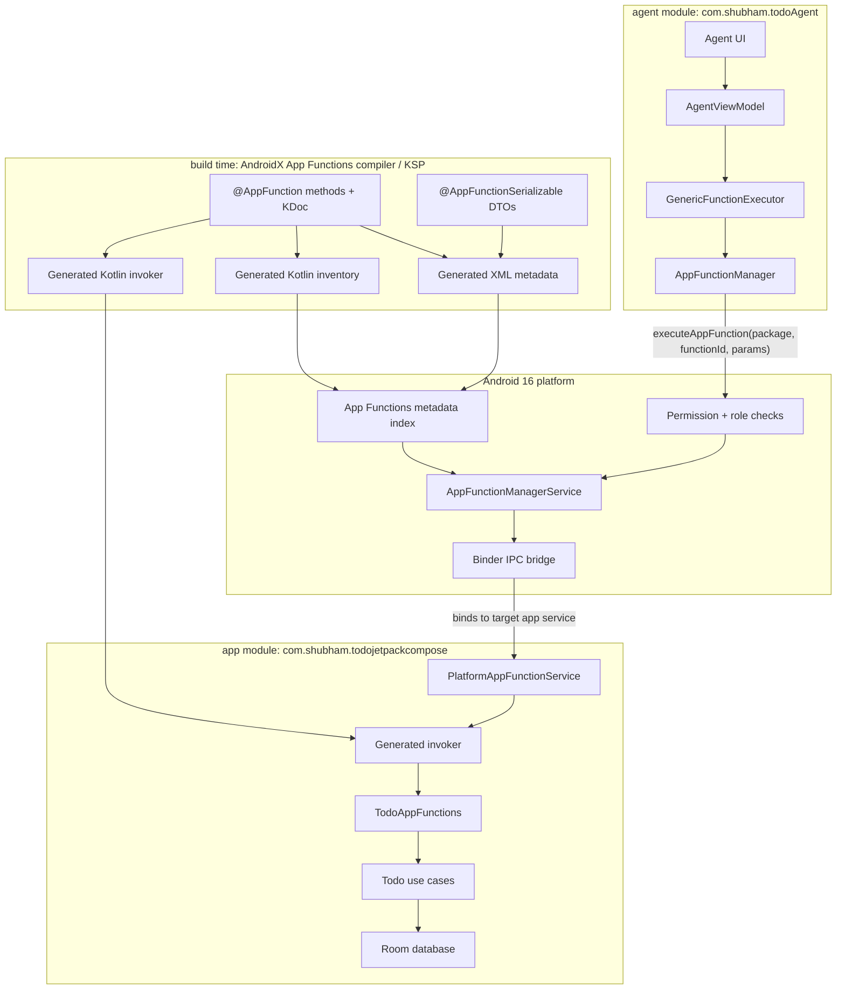
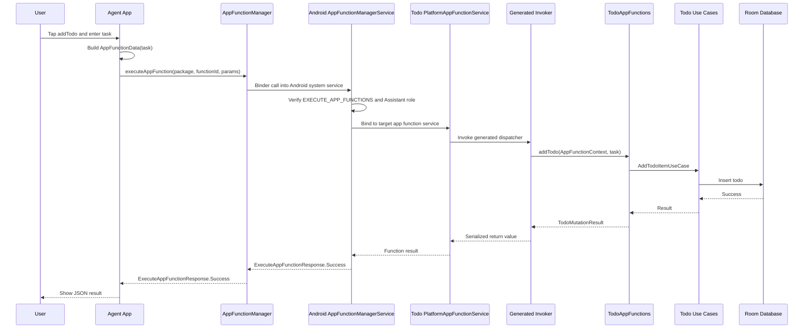
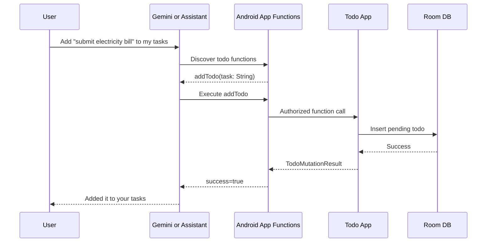

# Let AI Assistant Control Android App: Building a Todo App using App Functions on Android 16

## Overview

Imagine two Android devs sitting with chai and one says, "Bro, why should Gemini open my Todo app, find the add button, type into the field, and pray the UI did not change? Why can't the app just expose `addTodo()` directly?"

That is basically the App Functions dream.

Android App Functions are among the most interesting aspects of the Android 16 AI story. The idea is simple but powerful: instead of an assistant only opening an app and hoping the user taps through the right screens, the app can expose small, typed functions that describe what the app can do.

For a Todo app, that means the app can expose actions like:

- Add a todo
- List all todos
- List pending todos
- List completed todos
- Mark a todo as completed
- Reopen a completed todo
- Delete a todo
- Return to-do statistics

This article walks through a small experiment where I built a Jetpack Compose Todo app and a separate agent app that can control the Todo app through Android 16 App Functions.

The practical goal was very simple:

> Build the Todo app so an AI agent can use its functionality directly, without depending on the Todo app UI being open.

Important reality check before we become full hype uncle: this does not mean every public Gemini build can invoke every third-party app today. The app is built in the correct App Functions shape, and a privileged assistant-style agent can call it. Gemini/Assistant product support depends on Google's rollout.

## Table of Contents

1. Why I Used a Rooted Pixel 6 Android 16 API 36.1 Non-Play Emulator
2. How I Rooted the Emulator with RootAVD
3. Project Structure
4. Module-by-Module Setup
5. How Android App Functions Work
6. Deep Dive: App Functions Annotations and Generated Internals
7. Generated App Functions XML and Kotlin Files
8. Commands to Inspect App Functions
9. Step 1: Create the Todo App
10. Step 2: Add AndroidX App Functions Dependencies
11. Step 3: Create Serializable Function Models
12. Step 4: Expose Todo Actions with `@AppFunction`
13. Step 5: Wire Hilt into App Functions
14. Step 6: Add Manifest Metadata
15. Step 7: Build the Agent App
16. Step 8: Permissions and Privileged Agent Setup
17. Step 9: End-to-End Execution Flow
18. What Worked on the Emulator
19. The Future: Gemini, Agents, and App Capability APIs
20. Conclusion

## Why I Used a Rooted Pixel 6 Android 16 API 36.1 Non-Play Emulator

I used a Pixel 6 Android 16 API 36.1 emulator as the current test device for this project.

The exact AVD was:

```text
Pixel_6_36_1_AppFunctions
```

I chose this device/image for two practical reasons:

- Android 16 / API 36.1 had a working `cmd app_function` shell implementation, so I could run `adb shell cmd app_function list-app-functions` and verify the platform registry directly.
- The non-Play Google APIs image could be rooted cleanly, so `adb root` worked and the agent app could be tested as a privileged Assistant-style caller.

That second point mattered because the caller app, meaning the agent app, needs platform-level permission to execute another app's functions.

The two important permissions are:

```xml
<uses-permission android:name="android.permission.EXECUTE_APP_FUNCTIONS" />
<uses-permission android:name="android.permission.EXECUTE_APP_ACTION" />
```

Requesting these permissions in the manifest is not enough for a normal APK.

On Android 16:

- `android.permission.EXECUTE_APP_FUNCTIONS` is a privileged/internal permission.
- `android.permission.EXECUTE_APP_ACTION` is role-managed and can be granted to an Assistant-role app.
- A normal app installed with `adb install` can request these permissions, but it will not actually receive them.

That is why a normal agent install showed:

```text
EXECUTE_APP_FUNCTIONS=missing, EXECUTE_APP_ACTION=missing
```

After privileged placement plus Assistant role grant, it showed:

```text
EXECUTE_APP_FUNCTIONS=granted, EXECUTE_APP_ACTION=granted
```

I used a non-Play style Android 16 API 36.1 emulator image for the final setup because `adb root` was not reliable on the Play Store / Play Service emulator images I tried. Simple rule for this experiment: if `adb root` does not work, the privileged caller setup becomes unnecessary wrestling.

The final working image was:

```text
system-images;android-36.1;google_apis;arm64-v8a
```

The current device / AVD I used:

```text
Pixel_6_36_1_AppFunctions
```

The working build fingerprint looked like:

```text
google/sdk_gphone64_arm64/emu64a:16/BE4B.251210.005/14574095:userdebug/dev-keys
```

One more gotcha: an older Android 16 API 36 image returned this:

```bash
adb shell cmd app_function list-app-functions
```

```text
No shell command implementation.
```

That did not mean my generated App Functions metadata was broken. It meant that emulator image did not expose the `cmd app_function` shell implementation properly. API 36.1 worked.

To create the AVD:

```bash
sdkmanager "system-images;android-36.1;google_apis;arm64-v8a"

avdmanager create avd \
  -n Pixel_6_36_1_AppFunctions \
  -k "system-images;android-36.1;google_apis;arm64-v8a" \
  -d pixel_6
```

## How I Rooted the Emulator with RootAVD

This is the rooting flow I used for the Android 16 emulator.

First, create or select the Pixel 6 API 36.1 AVD. I used an ARM64 Google APIs image because this was the image where both required parts worked together: root access and the App Functions shell command. Before patching, shut down the emulator completely. Cold boot matters here. Quick boot can make you think nothing changed.

Then use RootAVD. The important input is the `ramdisk.img` from the Android system image.

```bash
git clone https://gitlab.com/newbit/rootAVD.git
cd rootAVD

./rootAVD.sh ListAllAVDs
```

Patch the ramdisk. Example command:

```bash
./rootAVD.sh system-images/android-36/google_apis_playstore/arm64-v8a/ramdisk.img
```

For the final Android 36.1 Google APIs image, the path will look more like this:

```bash
./rootAVD.sh system-images/android-36.1/google_apis/arm64-v8a/ramdisk.img
```

If your SDK is under `$ANDROID_HOME`, the full path is usually:

```text
$ANDROID_HOME/system-images/android-36.1/google_apis/arm64-v8a/ramdisk.img
```

Now cold boot the emulator.

Verify root:

```bash
adb root
adb wait-for-device
adb shell id
adb shell 'which su'
adb shell 'su 0 id'
```

Expected shape:

```text
uid=0(root)
/system/xbin/su
uid=0(root)
```

Interactive check:

```bash
adb shell
su
whoami
```

Expected:

```text
root
```

In my final working emulator:

```text
adb root: works
adb shell id: uid=0(root)
su binary: /system/xbin/su
SELinux: Enforcing
```

Root is only for the local lab setup. Production devices should not need this kind of manual setup for real Assistant integration once the platform flow is publicly available.

## Project Structure

The project has two Android application modules:

```text
TodoJetpackCompose/
|-- app/
|   `-- Jetpack Compose Todo app
`-- agent/
    `-- Debug AI-agent-style app that discovers and executes Todo functions
```

The `app` module owns the real Todo data and UI:

```text
app/src/main/java/com/shubham/todojetpackcompose/
|-- TodoApp.kt
|-- appfunctions/
|   |-- TodoAppFunctions.kt
|   |-- TodoAppFunctionConfiguration.kt
|   `-- schemas/
|       `-- TodoFunctionSchemas.kt
|-- data/
|   |-- database/
|   `-- repo/
|-- domain/
|   |-- models/
|   |-- repo/
|   `-- usecases/
`-- presentation/
```

The `agent` module is a separate caller app. I kept it in a small MVVM-ish structure so it feels like a real app, not just one giant demo activity:

```text
agent/src/main/java/com/shubham/todoAgent/
|-- TodoApp.kt
|-- core/
|   |-- appfunctions/
|   |   |-- AppFunctionDataTypeMetadataAdapter.kt
|   |   `-- FunctionMappers.kt
|   `-- di/
|       `-- AppModule.kt
|-- data/
|   `-- executor/
|       `-- GenericFunctionExecutor.kt
|-- domain/
|   `-- model/
|       `-- FunctionDeclaration.kt
`-- presentation/
    |-- AgentViewModel.kt
    `-- ui/
        `-- MainActivity.kt
```

Clean mental model:

```text
Todo app = capability owner
Agent app = privileged capability caller
Android = permission gatekeeper and IPC broker
```

## Module-by-Module Setup

This project has two app modules, and both have different jobs.

### App Module

The app module is the real Todo app. It owns:

- Compose UI
- Room database
- Todo repository
- Domain use cases
- App Functions exposed by `TodoAppFunctions`
- App metadata XML

The important app module files are:

```text
app/
|-- build.gradle.kts
|-- src/main/AndroidManifest.xml
|-- src/main/res/xml/app_metadata.xml
`-- src/main/java/com/shubham/todojetpackcompose/
    |-- TodoApp.kt
    |-- appfunctions/
    |   |-- TodoAppFunctions.kt
    |   |-- TodoAppFunctionConfiguration.kt
    |   `-- schemas/TodoFunctionSchemas.kt
    |-- data/
    |-- domain/
    `-- presentation/
```

### Agent Module

The agent module is a separate app. It does not own todos. It discovers functions from the Todo app, builds function parameters, executes through `AppFunctionManager`, and renders the result.

The important agent module files are:

```text
agent/
|-- build.gradle.kts
|-- src/main/AndroidManifest.xml
`-- src/main/java/com/shubham/todoAgent/
    |-- TodoApp.kt
    |-- core/
    |   |-- appfunctions/
    |   |   |-- AppFunctionDataTypeMetadataAdapter.kt
    |   |   `-- FunctionMappers.kt
    |   `-- di/AppModule.kt
    |-- data/executor/GenericFunctionExecutor.kt
    |-- domain/model/FunctionDeclaration.kt
    `-- presentation/
        |-- AgentViewModel.kt
        `-- ui/MainActivity.kt
```

## How Android App Functions Work

At a high level, App Functions turn app behavior into typed callable capabilities.

Instead of:

```text
Assistant -> open app -> inspect screen -> click button -> type text -> hope UI did not change
```

We get:

```text
Assistant/agent -> discover function -> build typed parameters -> Android checks permission -> app executes function -> typed result
```

For this project:

```text
Agent app -> AppFunctionManager -> Android App Functions runtime -> TodoAppFunctions -> Use cases -> Room DB
```

The Todo app UI does not need to be open. The App Function calls the same business logic that the UI already uses.



This is the big thing: the agent is not doing a random IPC hack. It calls `AppFunctionManager`, Android checks whether the caller is allowed, then Android binds into the target app's App Functions service and dispatches through generated code.

## Deep Dive: App Functions Annotations and Generated Internals

The App Functions API is annotation-driven.

The main annotations used here are:

- `@AppFunction`: marks a Kotlin function as a callable app capability.
- `@AppFunctionSerializable`: marks request/response DTOs that can cross the App Functions boundary.
- `@AppFunctionStringValueConstraint`: adds metadata constraints, like allowed enum values.
- `isDescribedByKDoc = true`: tells the compiler to use KDoc as descriptions for functions, parameters, and return values.

This is important for AI/agent use cases. The model or caller should not guess what `status` means. It should see structured metadata saying `"PENDING"` and `"COMPLETED"` are the valid values.

An App Function has a stable ID:

```text
com.shubham.todojetpackcompose.appfunctions.TodoAppFunctions#addTodo
```

That ID is used by:

- Android's App Functions index
- `AppFunctionManager`
- The agent app
- `adb shell cmd app_function execute-app-function`
- Future assistant-style callers

The generated Kotlin code has two important jobs:

- Inventory: tells Android what functions exist in the app process.
- Invoker: maps a function ID to the real Kotlin method call.

So when the agent calls `addTodo`, the system does not search your source code at runtime. The compiler has already generated the dispatch path.

## Generated App Functions XML and Kotlin Files

Yes, App Functions generate XML and Kotlin.

After building:

```bash
./gradlew :app:assembleDebug
```

Important generated files:

```text
app/build/generated/ksp/debug/resources/assets/app_functions.xml
app/build/generated/ksp/debug/resources/assets/app_functions_v2.xml
app/build/generated/ksp/debug/kotlin/com/shubham/todojetpackcompose/appfunctions/$TodoAppFunctions_AppFunctionInventory.kt
app/build/generated/ksp/debug/kotlin/com/shubham/todojetpackcompose/appfunctions/$TodoAppFunctions_AppFunctionInvoker.kt
app/build/generated/ksp/debug/kotlin/com/shubham/todojetpackcompose/appfunctions/TodoAppFunctionsIds.kt
```

Tiny but important clarification: I did not create an `app/src/main/assets` folder. You do not need to manually put `app_functions.xml` or `app_functions_v2.xml` inside source assets.

The `assets/` path above is a generated build output path. KSP writes the App Functions XML into generated resources, and the Android Gradle Plugin packages those generated files into the APK's assets section. That is why the app works even though the project source tree has no assets folder. Thoda magic lagta hai, but it is just Gradle packaging generated resources.

The XML files:

```text
app_functions.xml        Generated compact function ID list
app_functions_v2.xml     Generated rich metadata: descriptions, params, return types, schemas
app_functions_schema.xsd Packaged schema file from AndroidX App Functions assets
app_metadata.xml         Hand-written app-level metadata in res/xml
```

Where they end up inside the Todo APK after packaging:

```text
assets/app_functions.xml
assets/app_functions_v2.xml
assets/app_functions_schema.xsd
res/xml/app_metadata.xml
```

So yes, there is more than one XML, but only `app/src/main/res/xml/app_metadata.xml` is manually created in this project. Two XML files are generated by the AndroidX App Functions compiler, one XSD is packaged from the library assets, and one app metadata XML is written by us.

The generated XML is created from:

- `@AppFunction` methods in `TodoAppFunctions.kt`
- KDoc when `isDescribedByKDoc = true`
- `@AppFunctionSerializable` DTOs
- Parameter and return types
- Constraints like `@AppFunctionStringValueConstraint`

During packaging, generated resources move through the Android build intermediates and become APK assets:

```text
app/build/intermediates/java_res/debug/processDebugJavaRes/out/assets/app_functions.xml
app/build/intermediates/java_res/debug/processDebugJavaRes/out/assets/app_functions_v2.xml
```

The XSD goes through assets processing:

```text
app/build/intermediates/assets/debug/mergeDebugAssets/app_functions_schema.xsd
app/build/intermediates/compressed_assets/debug/compressDebugAssets/out/assets/app_functions_schema.xsd.jar
```

The hand-written app metadata goes through Android resources:

```text
app/src/main/res/xml/app_metadata.xml
app/build/intermediates/packaged_res/debug/packageDebugResources/xml/app_metadata.xml
```

Verify final APK contents:

```bash
unzip -l app/build/outputs/apk/debug/app-debug.apk \
  | grep -E 'app_functions|app_metadata|schema'
```

Expected shape:

```text
assets/app_functions_schema.xsd
res/xml/app_metadata.xml
assets/app_functions.xml
assets/app_functions_v2.xml
```

The merged APK manifest also contains the AndroidX App Functions service:

```xml
<service
    android:name="androidx.appfunctions.service.PlatformAppFunctionService"
    android:permission="android.permission.BIND_APP_FUNCTION_SERVICE"
    android:exported="true">
    <property
        android:name="android.app.appfunctions"
        android:value="app_functions.xml" />
    <property
        android:name="android.app.appfunctions.v2"
        android:value="app_functions_v2.xml" />
    <intent-filter>
        <action android:name="android.app.appfunctions.AppFunctionService" />
    </intent-filter>
</service>
```

Think of the generated XML as the app's machine-readable menu card. Android can read it and say, "This app exposes `addTodo(task: String)` and returns `TodoMutationResult`." The generated Kotlin invoker is the kitchen route that actually calls the method.

Example compact XML:

```xml
<appfunctions>
    <appfunction>
        <function_id>com.shubham.todojetpackcompose.appfunctions.TodoAppFunctions#addTodo</function_id>
        <enabled_by_default>true</enabled_by_default>
    </appfunction>
</appfunctions>
```

Example rich XML shape:

```xml
<appfunction>
    <id>com.shubham.todojetpackcompose.appfunctions.TodoAppFunctions#addTodo</id>
    <enabledByDefault>true</enabledByDefault>
    <description>
        Creates and saves a new todo item with the given task description.
    </description>
    <parameters>
        <name>task</name>
        <isRequired>true</isRequired>
        <description>The task description to save. Must not be blank.</description>
    </parameters>
    <response>
        <valueType>
            <referenceDataType>
                com.shubham.todojetpackcompose.appfunctions.schemas.TodoMutationResult
            </referenceDataType>
        </valueType>
    </response>
</appfunction>
```

Inspect generated files:

```bash
sed -n '1,220p' app/build/generated/ksp/debug/resources/assets/app_functions.xml
sed -n '1,260p' app/build/generated/ksp/debug/resources/assets/app_functions_v2.xml
```

Check APK manifest references:

```bash
apkanalyzer manifest print app/build/outputs/apk/debug/app-debug.apk \
  | grep -E 'app_functions.xml|app_functions_v2.xml|AppFunctionService'
```

Expected important lines:

```text
androidx.appfunctions.service.PlatformAppFunctionService
android.app.appfunctions
app_functions.xml
android.app.appfunctions.v2
app_functions_v2.xml
```

The agent module also has App Functions dependencies because it consumes the API and metadata classes. If the compiler creates empty generated metadata for the agent, that is okay because the agent is not exposing Todo functions. The Todo app is the capability owner.

## Commands to Inspect App Functions

Build first:

```bash
./gradlew :app:assembleDebug :agent:assembleDebug
```

Install the Todo app:

```bash
adb install -r app/build/outputs/apk/debug/app-debug.apk
```

List all App Functions visible to Android:

```bash
adb shell cmd app_function list-app-functions
```

If multiple emulators are connected:

```bash
adb devices
adb -s emulator-5554 shell cmd app_function list-app-functions
```

Or set the serial once:

```bash
export ANDROID_SERIAL=emulator-5554
adb shell cmd app_function list-app-functions
```

Print only this Todo app's function IDs:

```bash
adb shell cmd app_function list-app-functions \
  | jq -r '."com.shubham.todojetpackcompose"[] | .[]? | select(type=="object") | .functionId?[]?' \
  | sort -u
```

Expected:

```text
com.shubham.todojetpackcompose.appfunctions.TodoAppFunctions#addTodo
com.shubham.todojetpackcompose.appfunctions.TodoAppFunctions#completeTodo
com.shubham.todojetpackcompose.appfunctions.TodoAppFunctions#deleteTodo
com.shubham.todojetpackcompose.appfunctions.TodoAppFunctions#getAllTodos
com.shubham.todojetpackcompose.appfunctions.TodoAppFunctions#getCompletedTodos
com.shubham.todojetpackcompose.appfunctions.TodoAppFunctions#getPendingTodos
com.shubham.todojetpackcompose.appfunctions.TodoAppFunctions#getTodoStats
com.shubham.todojetpackcompose.appfunctions.TodoAppFunctions#reopenTodo
```

On my API 36.1 build, `list-app-functions --package ...` was not supported. Filtering with `jq` was the reliable route.

Generic execute command:

```bash
adb shell cmd app_function execute-app-function \
  --package <PACKAGE_NAME> \
  --function <FUNCTION_ID> \
  --parameters <PARAMS_IN_JSON>
```

Execute stats:

```bash
adb shell "cmd app_function execute-app-function \
  --package com.shubham.todojetpackcompose \
  --function 'com.shubham.todojetpackcompose.appfunctions.TodoAppFunctions#getTodoStats' \
  --parameters '{}'"
```

Sample output:

```json
{
  "androidAppfunctionsReturnValue": [
    {
      "completed": [1],
      "pending": [2],
      "total": [3]
    }
  ]
}
```

Execute add:

```bash
adb shell "cmd app_function execute-app-function \
  --package com.shubham.todojetpackcompose \
  --function 'com.shubham.todojetpackcompose.appfunctions.TodoAppFunctions#addTodo' \
  --parameters '{\"task\":\"Created from cmd app_function\"}'"
```

Sample output:

```json
{
  "androidAppfunctionsReturnValue": [
    {
      "success": [true],
      "message": ["Task 'Created from cmd app_function' added successfully."]
    }
  ]
}
```

Read todos:

```bash
adb shell "cmd app_function execute-app-function \
  --package com.shubham.todojetpackcompose \
  --function 'com.shubham.todojetpackcompose.appfunctions.TodoAppFunctions#getAllTodos' \
  --parameters '{}'"
```

Sample output:

```json
{
  "androidAppfunctionsReturnValue": [
    {
      "id": ["1777205106079"],
      "task": ["Created from cmd app_function"],
      "status": ["PENDING"]
    }
  ]
}
```

Complete a todo:

```bash
adb shell "cmd app_function execute-app-function \
  --package com.shubham.todojetpackcompose \
  --function 'com.shubham.todojetpackcompose.appfunctions.TodoAppFunctions#completeTodo' \
  --parameters '{\"todoId\":\"1777205106079\"}'"
```

Sample output:

```json
{
  "androidAppfunctionsReturnValue": [
    {
      "success": [true],
      "message": ["Todo 'Created from cmd app_function' marked as completed."]
    }
  ]
}
```

Terminal note: when JSON contains quotes, wrap the remote command in `adb shell "..."` and escape JSON quotes. Otherwise your host shell will eat the JSON and Android will stare at you like, "Bhai, parameter kidhar hai?"

## Step 1: Create the Todo App

The Todo app is a regular Jetpack Compose app with Room and Hilt.

The human flow is:

```text
Compose UI -> ViewModel -> Use cases -> Repository -> Room DB
```

The App Functions flow reuses the same domain layer:

```text
AppFunctionManager -> TodoAppFunctions -> Use cases -> Repository -> Room DB
```

This is the correct design. Do not duplicate Todo logic inside the agent layer. The Todo app owns Todo behavior.

## Step 2: Add AndroidX App Functions Dependencies

Versions in `gradle/libs.versions.toml`:

```toml
[versions]
appfunctions = "1.0.0-alpha08"
appfunctionsService = "1.0.0-alpha08"
appfunctionsCompiler = "1.0.0-alpha08"

[libraries]
androidx-appfunctions = { module = "androidx.appfunctions:appfunctions", version.ref = "appfunctions" }
androidx-appfunctions-service = { module = "androidx.appfunctions:appfunctions-service", version.ref = "appfunctionsService" }
androidx-appfunctions-compiler = { module = "androidx.appfunctions:appfunctions-compiler", version.ref = "appfunctionsCompiler" }
```

Todo app Gradle setup:

```kotlin
android {
    namespace = "com.shubham.todojetpackcompose"
    compileSdk = 36

    defaultConfig {
        applicationId = "com.shubham.todojetpackcompose"
        minSdk = 36
        targetSdk = 36
    }

    ksp {
        arg("room.schemaLocation", "$projectDir/schemas")
        arg("appfunctions:aggregateAppFunctions", "true")
        arg("appfunctions:generateMetadataFromSchema", "false")
    }
}

dependencies {
    implementation(libs.androidx.appfunctions)
    implementation(libs.androidx.appfunctions.service)
    ksp(libs.androidx.appfunctions.compiler)
}
```

Agent Gradle setup:

```kotlin
android {
    namespace = "com.shubham.todoAgent"
    compileSdk = 36

    defaultConfig {
        minSdk = 36
    }

    ksp {
        arg("appfunctions:aggregateAppFunctions", "true")
    }
}

dependencies {
    implementation(libs.androidx.appfunctions)
    implementation(libs.androidx.appfunctions.service)
    ksp(libs.androidx.appfunctions.compiler)
}
```

The Todo app needs the compiler because it exposes functions. The agent needs the runtime API and metadata classes because it discovers and executes functions.

## Step 3: Create Serializable Function Models

Do not expose internal Room entities as your public function contract. Create DTOs for the App Functions boundary.

```kotlin
package com.shubham.todojetpackcompose.appfunctions.schemas

import androidx.appfunctions.service.AppFunctionSerializable
import androidx.appfunctions.service.AppFunctionStringValueConstraint

@AppFunctionSerializable(isDescribedByKDoc = true)
data class AppFunctionTodoItem(
    /** Unique identifier for the todo. */
    val id: String,
    /** The task description text. */
    val task: String,
    /** Current status. Always one of "PENDING" or "COMPLETED". */
    @AppFunctionStringValueConstraint(enumValues = ["PENDING", "COMPLETED"])
    val status: String,
)

@AppFunctionSerializable(isDescribedByKDoc = true)
data class TodoMutationResult(
    /** True if the operation completed successfully. */
    val success: Boolean,
    /** Human-readable message describing the outcome. */
    val message: String,
)

@AppFunctionSerializable(isDescribedByKDoc = true)
data class TodoStats(
    /** Total number of todos. */
    val total: Int,
    /** Number of completed todos. */
    val completed: Int,
    /** Number of pending todos. */
    val pending: Int,
)
```

That enum constraint is a small but very useful agent hint. Instead of guessing between `done`, `complete`, and `COMPLETED`, the metadata says exactly what values exist.

Less AI jugaad, more typed contract.

## Step 4: Expose Todo Actions with `@AppFunction`

The core file:

```text
app/src/main/java/com/shubham/todojetpackcompose/appfunctions/TodoAppFunctions.kt
```

The class uses the real app use cases:

```kotlin
class TodoAppFunctions @Inject constructor(
    private val getTodoListUseCase: GetTodoListUseCase,
    private val addTodoItemUseCase: AddTodoItemUseCase,
    private val deleteTodoItemUseCase: DeleteTodoItemUseCase,
    private val updateTodoItemUseCase: UpdateTodoItemUseCase,
)
```

Example function:

```kotlin
/**
 * Creates and saves a new todo item with the given task description.
 * Use this when the user wants to add, create, or remember a new task or todo item.
 *
 * @param appFunctionContext Execution context provided by the Android system.
 * @param task The task description to save. Must not be blank.
 * @return A [TodoMutationResult] indicating whether the task was saved successfully.
 */
@AppFunction(isDescribedByKDoc = true)
suspend fun addTodo(
    appFunctionContext: AppFunctionContext,
    task: String,
): TodoMutationResult {
    if (task.isBlank()) {
        throw AppFunctionInvalidArgumentException("Task description must not be blank.")
    }

    val newItem = TodoItem(
        id = System.currentTimeMillis(),
        task = task.trim(),
        status = Utils.TodoStatus.PENDING.name,
    )

    return when (val result = addTodoItemUseCase(newItem)) {
        is Utils.Either.Success -> {
            result.data.first()
            TodoMutationResult(true, "Task '${newItem.task}' added successfully.")
        }
        is Utils.Either.Error -> {
            TodoMutationResult(false, result.exception.message ?: "Failed to add task.")
        }
    }
}
```

Parameterized update function:

```kotlin
@AppFunction(isDescribedByKDoc = true)
suspend fun completeTodo(
    appFunctionContext: AppFunctionContext,
    todoId: String,
): TodoMutationResult = updateTodoStatus(
    todoId = todoId,
    expectedCurrentStatus = Utils.TodoStatus.PENDING.name,
    newStatus = Utils.TodoStatus.COMPLETED.name,
    alreadyInStateMessage = "Todo is already completed.",
    successMessage = { task -> "Todo '$task' marked as completed." },
)
```

The final Todo capability surface:

```text
TodoAppFunctions#addTodo
TodoAppFunctions#getAllTodos
TodoAppFunctions#getPendingTodos
TodoAppFunctions#getCompletedTodos
TodoAppFunctions#completeTodo
TodoAppFunctions#reopenTodo
TodoAppFunctions#deleteTodo
TodoAppFunctions#getTodoStats
```

## Step 5: Wire Hilt into App Functions

`TodoAppFunctions` needs injected use cases. The generated invoker needs a way to create that class with Hilt dependencies.

Application setup:

```kotlin
@HiltAndroidApp
class TodoApp :
    Application(),
    AppFunctionConfiguration.Provider {

    @Inject
    lateinit var todoAppFunctionConfiguration: TodoAppFunctionConfiguration

    override val appFunctionConfiguration: AppFunctionConfiguration
        get() = todoAppFunctionConfiguration.build()
}
```

Configuration bridge:

```kotlin
class TodoAppFunctionConfiguration @Inject constructor(
    private val todoAppFunctionsProvider: Provider<TodoAppFunctions>,
) {
    fun build(): AppFunctionConfiguration =
        AppFunctionConfiguration.Builder()
            .addEnclosingClassFactory(TodoAppFunctions::class.java) {
                todoAppFunctionsProvider.get()
            }
            .build()
}
```

Without this bridge, the generated invoker would not know how to construct `TodoAppFunctions` with injected use cases.

## Step 6: Add Manifest Metadata

Do we need to write `app_metadata.xml` ourselves?

For this project, yes. This is the one App Functions XML file I wrote manually.

The generated files like `app_functions.xml` and `app_functions_v2.xml` come from the `@AppFunction` annotations. But `app_metadata.xml` is different. It is app-level metadata: a natural-language description of what the app does and how an AI agent or LLM should think about the app's exposed functions.

Think of it like this:

```text
app_functions.xml     = generated list of exact callable functions
app_functions_v2.xml  = generated function params, response, schemas, KDoc
app_metadata.xml      = hand-written app-level "what is this app?" context
```

In this project, the KSP config is explicit:

```kotlin
ksp {
    arg("appfunctions:aggregateAppFunctions", "true")
    arg("appfunctions:generateMetadataFromSchema", "false")
}
```

So the Todo functions are aggregated and generated from annotations, while the app-level description stays under our control.

Create this file:

```text
app/src/main/res/xml/app_metadata.xml
```

The metadata should be short, concrete, and capability-focused. Do not write marketing copy. Write what an assistant needs to know.

Good metadata answers:

- What kind of app is this?
- What user tasks can it perform?
- Which concepts matter? For example: pending todos, completed todos, todo stats.
- What should an agent use this app for?

For the Todo app, I wrote:

```xml
<?xml version="1.0" encoding="utf-8"?>
<app-metadata>
    <!-- For the agent/LLM: what this app can do -->
    <description>
        ComposeTodo is a local todo list app. It can list all tasks, only pending tasks,
        or only completed tasks; add a new task; mark a task as completed; reopen a completed
        task; delete a task; and return todo statistics.
    </description>

    <!-- For UI surfaces: short user-facing summary -->
    <display-description>
        View and manage your todo tasks with add, list, complete, reopen, delete, and stats.
    </display-description>
</app-metadata>
```

Then the Todo app manifest points Android to that app-level metadata:

```xml
<application
    android:name=".TodoApp"
    ...>

    <property
        android:name="android.app.appfunctions.app_metadata"
        android:resource="@xml/app_metadata" />

</application>
```

That manifest property is the important bridge:

```xml
<property
    android:name="android.app.appfunctions.app_metadata"
    android:resource="@xml/app_metadata" />
```

Without this property, Android has generated function metadata, but it does not get this extra app-level description through the app metadata resource.

The full metadata file again, with the mental model:

```xml
<?xml version="1.0" encoding="utf-8"?>
<app-metadata>
    <!-- Long description: useful to agents/LLMs -->
    <description>
        ComposeTodo is a local todo list app. It can list all tasks, only pending tasks,
        or only completed tasks; add a new task; mark a task as completed; reopen a completed
        task; delete a task; and return todo statistics.
    </description>

    <!-- Short description: useful to display surfaces -->
    <display-description>
        View and manage your todo tasks with add, list, complete, reopen, delete, and stats.
    </display-description>
</app-metadata>
```

This file is not the function list. The function list is generated from annotations. This file is app-level context: what the app does overall.

To verify it is packaged:

```bash
unzip -l app/build/outputs/apk/debug/app-debug.apk \
  | grep app_metadata
```

Expected:

```text
res/xml/app_metadata.xml
```

Writing tip: keep `app_metadata.xml` aligned with your real `@AppFunction` methods. If the metadata says the app can delete todos, there should be a real `deleteTodo` function. If the function does not exist, do not promise it here. Otherwise the agent gets excited and then Android says, "Function not found, bro."

## Step 7: Build the Agent App

The agent app uses `AppFunctionManager`.

### Agent Discovery

Discovery is the first half of the agent story. The agent does not hardcode the Todo functions manually. Instead, it asks Android:

```text
"Show me App Functions exposed by com.shubham.todojetpackcompose."
```

That request goes through `AppFunctionSearchSpec`:

```kotlin
private const val TOOL_PACKAGE = "com.shubham.todojetpackcompose"

private fun observeToolFunctionsWithManager() {
    val spec = AppFunctionSearchSpec(packageNames = setOf(TOOL_PACKAGE))

    manager.observeAppFunctions(spec)
        .onEach { packages ->
            val pkg = packages.firstOrNull()
            if (pkg == null) {
                _result.value = "No AppFunctions discovered for $TOOL_PACKAGE via manager."
                _functions.value = emptyList()
            } else {
                val map = pkg.appFunctions.toFunctionDeclarations()
                functionMetadataMap.value = map
                _functions.value = map.keys.toList().sortedBy { it.shortName }
                _result.value = "Discovered ${map.size} functions (via manager)"
            }
        }
        .launchIn(viewModelScope)
}
```

What comes back is not just a function name. Android returns `AppFunctionMetadata`, which contains:

- Function ID
- Description from KDoc
- Parameter names
- Required parameters
- Parameter types
- Return type
- Referenced DTO schemas
- Enum constraints

The agent then converts platform metadata into its own domain model:

```kotlin
fun List<AppFunctionMetadata>.toFunctionDeclarations():
    Map<FunctionDeclaration, AppFunctionMetadata> =
    associateBy { it.toFunctionDeclaration() }

private fun AppFunctionMetadata.toFunctionDeclaration(): FunctionDeclaration =
    FunctionDeclaration(
        name = id,
        shortName = id.substringAfterLast("#"),
        description = description.ifBlank { id.substringAfterLast("#").humanizeIdentifier() },
        parameters = toParametersSchema(),
        response = response.valueType.toSchema(components),
    )
```

That `FunctionDeclaration` is what the agent UI can render as a callable tool:

```kotlin
data class FunctionDeclaration(
    val name: String,
    val shortName: String,
    val description: String,
    val parameters: Schema? = null,
    val response: Schema? = null,
)
```

For example, `addTodo` becomes something like:

```json
{
  "name": "com.shubham.todojetpackcompose.appfunctions.TodoAppFunctions#addTodo",
  "description": "Creates and saves a new todo item with the given task description.",
  "parameters": {
    "type": "object",
    "properties": {
      "task": {
        "type": "string",
        "description": "The task description to save. Must not be blank."
      }
    },
    "required": ["task"]
  }
}
```

This is the bridge from Android App Functions metadata to an AI-agent-style tool declaration. The agent can show a form, validate required fields, and build typed arguments without knowing anything about the Todo app UI.

One subtle but important point: discovery and execution are different gates. On Android 16, a caller may be able to observe metadata but still fail execution if it does not hold `android.permission.EXECUTE_APP_FUNCTIONS`. That is why I kept a visible permission status in the agent UI:

```text
EXECUTE_APP_FUNCTIONS=granted, EXECUTE_APP_ACTION=granted
```

Once discovery gives us metadata, execution becomes the second half.

### Agent Execution

```kotlin
val request = ExecuteAppFunctionRequest(
    functionIdentifier = functionDeclaration.name,
    targetPackageName = "com.shubham.todojetpackcompose",
    functionParameters = functionParameters,
)

val response = manager.executeAppFunction(request)
```

The agent manifest requests execution permissions:

```xml
<uses-permission android:name="android.permission.EXECUTE_APP_FUNCTIONS" />
<uses-permission android:name="android.permission.EXECUTE_APP_ACTION" />
```

It also declares package visibility into the Todo app:

```xml
<queries>
    <package android:name="com.shubham.todojetpackcompose" />
</queries>
```

And it declares Assistant-role eligibility:

```xml
<activity
    android:name="com.shubham.todoAgent.presentation.ui.MainActivity"
    android:exported="true">

    <intent-filter>
        <action android:name="android.intent.action.MAIN" />
        <category android:name="android.intent.category.LAUNCHER" />
    </intent-filter>

    <intent-filter>
        <action android:name="android.intent.action.ASSIST" />
        <category android:name="android.intent.category.DEFAULT" />
    </intent-filter>
</activity>
```

That Assistant intent filter is what made the agent eligible for the Assistant role grant in the emulator.

## Step 8: Permissions and Privileged Agent Setup

Build both APKs:

```bash
./gradlew :app:assembleDebug :agent:assembleDebug
```

Install the Todo app normally:

```bash
adb install -r app/build/outputs/apk/debug/app-debug.apk
```

Verify Android can see the Todo functions:

```bash
adb shell cmd app_function list-app-functions
```

If the agent was previously installed normally, remove it:

```bash
adb uninstall com.shubham.todoAgent
```

Make sure root is active:

```bash
adb root
adb wait-for-device
adb shell id
```

Expected:

```text
uid=0(root)
```

Why do we mount over an existing privileged APK?

Because this is an emulator-only lab trick. Android grants privileged permissions only to apps scanned from privileged system locations such as:

```text
/system/priv-app/<SomeExistingPrivApp>/<SomeExistingPrivApp>.apk
```

So we stage our agent APK with a clean name:

```text
/data/local/tmp/todoagent-runtime/system/priv-app/TodoAgent/TodoAgent.apk
```

Then we bind-mount that staged APK over one existing privileged APK path on the emulator. The app package is still `com.shubham.todoAgent`; the mount target is only used so PackageManager scans it as privileged.

This is not required by App Functions themselves. It is only a local way to prove the privileged caller path on a rooted emulator without rebuilding the system image.

Pick any existing privileged APK path from your emulator:

```bash
adb shell 'find /system/priv-app -maxdepth 2 -name "*.apk" | sort | head -20'
```

In the commands below, replace this placeholder with one real path from that output:

```text
<EXISTING_PRIV_APP_APK>
```

Example shape:

```text
/system/priv-app/<SomeExistingPrivApp>/<SomeExistingPrivApp>.apk
```

Stage the agent APK:

```bash
adb shell mkdir -p /data/local/tmp/todoagent-runtime/system/priv-app/TodoAgent
adb shell mkdir -p /data/local/tmp/todoagent-runtime/system/etc/permissions

adb push agent/build/outputs/apk/debug/agent-debug.apk \
  /data/local/tmp/todoagent-runtime/system/priv-app/TodoAgent/TodoAgent.apk
```

Create the privapp allowlist:

```bash
adb shell 'printf "%s\n" \
"<?xml version=\"1.0\" encoding=\"utf-8\"?>" \
"<permissions>" \
"    <privapp-permissions package=\"com.shubham.todoAgent\">" \
"        <permission name=\"android.permission.EXECUTE_APP_FUNCTIONS\" />" \
"    </privapp-permissions>" \
"</permissions>" \
> /data/local/tmp/todoagent-runtime/system/etc/permissions/todoagent-privapp-permissions.xml'
```

Fix permissions and SELinux context:

```bash
adb shell chmod 644 \
  /data/local/tmp/todoagent-runtime/system/priv-app/TodoAgent/TodoAgent.apk \
  /data/local/tmp/todoagent-runtime/system/etc/permissions/todoagent-privapp-permissions.xml

adb shell chown root:root \
  /data/local/tmp/todoagent-runtime/system/priv-app/TodoAgent/TodoAgent.apk \
  /data/local/tmp/todoagent-runtime/system/etc/permissions/todoagent-privapp-permissions.xml

adb shell chcon u:object_r:system_file:s0 \
  /data/local/tmp/todoagent-runtime/system/priv-app/TodoAgent/TodoAgent.apk \
  /data/local/tmp/todoagent-runtime/system/etc/permissions/todoagent-privapp-permissions.xml
```

Bind mount the agent APK over the existing privileged APK path you selected:

```bash
adb shell mount --bind \
  /data/local/tmp/todoagent-runtime/system/priv-app/TodoAgent/TodoAgent.apk \
  <EXISTING_PRIV_APP_APK>
```

Bind mount the permission XML over an existing permission XML target:

```bash
adb shell mount --bind \
  /data/local/tmp/todoagent-runtime/system/etc/permissions/todoagent-privapp-permissions.xml \
  /system/etc/permissions/android.software.window_magnification.xml
```

Restart framework:

```bash
adb shell 'rm -rf /data/system/package_cache/*'
adb shell stop
adb shell start
adb wait-for-device
```

Grant Assistant role:

```bash
adb shell cmd role set-bypassing-role-qualification true
adb shell cmd role add-role-holder android.app.role.ASSISTANT com.shubham.todoAgent
adb shell cmd role get-role-holders android.app.role.ASSISTANT
```

Expected:

```text
com.shubham.todoAgent
```

Verify permissions:

```bash
adb shell dumpsys package com.shubham.todoAgent | grep -E \
  'codePath|PRIVILEGED|EXECUTE_APP_FUNCTIONS|EXECUTE_APP_ACTION|granted='
```

Expected:

```text
codePath=/system/priv-app/<SomeExistingPrivApp>
privateFlags=[ ... PRIVILEGED ... ]
android.permission.EXECUTE_APP_ACTION: granted=true, flags=[ GRANTED_BY_ROLE]
android.permission.EXECUTE_APP_FUNCTIONS: granted=true
```

The important part in this output is not the existing app slot name. The important part is:

```text
codePath=/system/priv-app/...
privateFlags=[ ... PRIVILEGED ... ]
```

That proves Android scanned the agent as a privileged app and allowed the privileged App Functions execution permission.

Launch the agent:

```bash
adb shell am start -n \
  com.shubham.todoAgent/com.shubham.todoAgent.presentation.ui.MainActivity
```

In-app expected status:

```text
EXECUTE_APP_FUNCTIONS=granted, EXECUTE_APP_ACTION=granted
Discovered 8 functions (via manager)
```

## Step 9: End-to-End Execution Flow

This is the complete execution flow:



The Todo app UI does not need to be open.

That is the key future-facing idea.

## What Worked on the Emulator

Final verified setup:

```text
AVD: Pixel_6_36_1_AppFunctions
Android: 16 / API 36.1
Root: adb root works
Agent code path: /system/priv-app/<SomeExistingPrivApp>
Agent permissions: EXECUTE_APP_FUNCTIONS=granted, EXECUTE_APP_ACTION=granted
Discovery: Discovered 8 functions (via manager)
Execution: addTodo succeeded through AppFunctionManager
ADB platform command: cmd app_function list-app-functions works
```

The agent successfully added a todo through `AppFunctionManager`:

```text
ManagerOnlyAgentTest
```

Agent result:

```json
{
  "success": true,
  "message": "Task 'ManagerOnlyAgentTest' added successfully."
}
```

Then `cmd app_function execute-app-function` and `getAllTodos` returned the same task from the Todo app database.

## The Future: Gemini, Agents, and App Capability APIs

This is where things get properly interesting.

Current app automation often looks like:

```text
Open app -> inspect screen -> click button -> type text -> hope UI did not change
```

App Functions suggest a better future:

```text
User intent -> assistant selects typed function -> Android checks permission -> app executes capability -> typed result
```

For this Todo app:



Notice what did not happen:

- No screen scraping.
- No button hunting.
- No fragile deep link dependency.
- No Compose layout dependency.

The app exposes a capability. Android brokers it. The assistant uses it.

This pattern can apply to many apps:

- Calendar: `createEvent`, `rescheduleEvent`, `findFreeSlot`
- Notes: `createNote`, `searchNotes`, `summarizeNote`
- Food: `reorderLastMeal`, `trackOrder`
- Finance: `getBalance`, `setBudget`
- Todo: `addTodo`, `completeTodo`, `getPendingTodos`

Future Android apps may have two first-class interfaces:

```text
Human interface: Compose UI
Agent interface: App Functions
```

Same business logic. Different callers. Very neat, boss.

## Conclusion

This project turned a simple Jetpack Compose Todo app into an Android 16 App Functions capability surface.

Before:

```text
User -> UI -> ViewModel -> Use cases -> Room
```

After:

```text
User -> UI -> ViewModel -> Use cases -> Room
Agent -> AppFunctionManager -> TodoAppFunctions -> Use cases -> Room
```

The final implementation exposes all Todo functionality through platform App Functions:

- Create todos
- Read todos
- Filter pending/completed todos
- Complete todos
- Reopen todos
- Delete todos
- Get stats

The hardest part was not Kotlin. It was Android platform setup: API 36.1 emulator, root, privileged app placement, Assistant role, and permission verification.

But once that was done, the result was exactly what we wanted:

```text
An agent controlled the Todo app without opening the Todo app UI.
```

That is the future shape I like: apps that are beautiful for humans and callable for trusted assistants.

## References

- [Android App Functions documentation](https://developer.android.com/ai/appfunctions)
- [The Future of Android Apps with AppFunctions by Shreyas Patil](https://blog.shreyaspatil.dev/the-future-of-android-apps-with-appfunctions/)
- [RootAVD GitHub project](https://github.com/newbit1/rootAVD)
